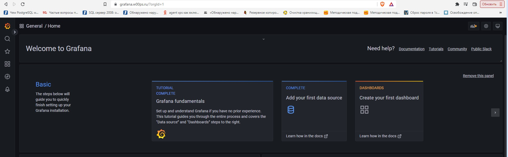
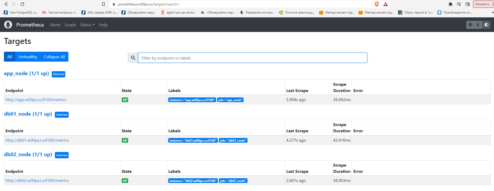

***Дипломный проект в YandexCloud***
**Цели:**

1. Зарегистрировать доменное имя (любое на ваш выбор в любой доменной зоне).
2. Подготовить инфраструктуру с помощью Terraform на базе облачного провайдера YandexCloud.
3. Настроить внешний Reverse Proxy на основе Nginx и LetsEncrypt.
4. Настроить кластер MySQL.
5. Установить WordPress.
6. Развернуть Gitlab CE и Gitlab Runner.
7. Настроить CI/CD для автоматического развёртывания приложения.
8. Настроить мониторинг инфраструктуры с помощью стека: Prometheus, Alert Manager и Grafana.

Этапы выполнения:

***1. Регистрация доменного имени***

Подойдет любое доменное имя на ваш выбор в любой доменной зоне. ПРИМЕЧАНИЕ: Далее в качестве примера используется 
домен you.domain замените его вашим доменом. Рекомендуемые регистраторы:

• nic.ru 
• reg.ru

**Цель:**

Получить возможность выписывать TLS сертификаты для веб-сервера.
Ожидаемые результаты:

У вас есть доступ к личному кабинету на сайте регистратора.
Вы зарезистрировали домен и можете им управлять (редактировать dns записи в рамках этого домена).

***Ответ***

Зарегистрировано доменное имя: w00ps.ru в регистраторе reg.ru


Арендован статический адрес: 130.193.37.140

***2. Создание инфраструктуры***

Для начала необходимо подготовить инфраструктуру в YC при помощи Terraform.

Особенности выполнения:

- Бюджет купона ограничен, что следует иметь в виду при проектировании инфраструктуры и использовании ресурсов;
- Следует использовать последнюю стабильную версию Terraform.
Предварительная подготовка:

1. Создайте сервисный аккаунт, который будет в дальнейшем использоваться Terraform для работы с инфраструктурой с 
необходимыми и достаточными правами. Не стоит использовать права суперпользователя
2. Подготовьте backend для Terraform:
а. Рекомендуемый вариант: Terraform Cloud б. Альтернативный вариант: S3 bucket в созданном YC аккаунте.

3. Настройте workspaces
а. Рекомендуемый вариант: создайте два workspace: stage и prod. В случае выбора этого варианта все последующие шаги должны учитывать факт существования нескольких workspace.
б. Альтернативный вариант: используйте один workspace, назвав его stage. Пожалуйста, не используйте workspace, создаваемый Terraform-ом по-умолчанию (default).

4. Создайте VPC с подсетями в разных зонах доступности.
5. Убедитесь, что теперь вы можете выполнить команды terraform destroy и terraform apply без дополнительных ручных действий.
6. В случае использования Terraform Cloud в качестве backend убедитесь, что применение изменений успешно проходит, используя web-интерфейс Terraform cloud.
**Цель:**


1. Повсеместно применять IaaC подход при организации (эксплуатации) инфраструктуры.
2. Иметь возможность быстро создавать (а также удалять) виртуальные машины и сети. С целью экономии денег на вашем аккаунте в YandexCloud.

**Ожидаемые результаты:**

1. Terraform сконфигурирован и создание инфраструктуры посредством Terraform возможно без дополнительных ручных действий.
2. Полученная конфигурация инфраструктуры является предварительной, поэтому в ходе дальнейшего выполнения задания возможны 
изменения является предварительной, поэтому в ходе дальнейшего выполнения задания возможны изменения.

***Ответ:***
Ответ: 
- data.txt - Пользователь и ключ для установки на ВМ;
- gitlab.tf - Настройки для ВМ под gitlab.
- runner.tf - Настройки для ВМ под runner.
- wordpress.tf - Настройки для ВМ под wordpress.
- nginx.tf - Настройки для ВМ под nginx.
- monitoring.tf - Настройки для ВМ под monitoring.
- mysql.tf - Настройки для ВМ под СУБД.
- network.tf - Содержит настройки сетей.
- providers.tf - Содержит настройки для подключения к провайдеру.
- variables.tf - ip адрес.


<details>

<summary>Terraform</summary>
[k55 terraform]# terraform apply

Terraform used the selected providers to generate the following execution plan. Resource actions are indicated with the following symbols:
  + create

Terraform will perform the following actions:

  # yandex_compute_instance.app will be created
  + resource "yandex_compute_instance" "app" {
      + created_at                = (known after apply)
      + folder_id                 = (known after apply)
      + fqdn                      = (known after apply)
      + hostname                  = "app.w00ps.ru"
      + id                        = (known after apply)
      + metadata                  = {
          + "user-data" = <<-EOT
                #cloud-config
                users:
                  - name: k55
                    groups: sudo
                    shell: /bin/bash
                    sudo: ['ALL=(ALL) NOPASSWD:ALL']
                    ssh_authorized_keys:
                      - ssh-rsa AAAAB3NzaC1yc2EAAAADAQABAAABAQDudxU/AQ7WusOm0FOQDGYXDph3Pw7xYfxCaVC78USouj18Uacd6TV7wMX0Tnhh4dssPWzoKgEF3hYrRNbGAdi5c4JD/qFKQavcnyBJyRmhXDyFDtn1bK3rfw78lW7iIFDxS6VcNk+PaE03shcO3IbOGhS7HKX2hTimyL66ag+wmJA7sllMis+a9bgSkBapciZm6PEOEiwXbqsnCcxO8DUyXSgLYrUmGA9IhaoJPFw8D9E3SzRVSBMRK0qbaZWoziJxRB3cyLX5Oe7Zddt99/rWYJxXIouP12+C68keWFv1eW4PmIV1BtiCrN1hFKWIpEyXb5y7Tic8e/wqRMuPkTBV k55@k55
            EOT
        }
      + name                      = "app"
      + network_acceleration_type = "standard"
      + platform_id               = "standard-v1"
      + service_account_id        = (known after apply)
      + status                    = (known after apply)
      + zone                      = (known after apply)

      + boot_disk {
          + auto_delete = true
          + device_name = (known after apply)
          + disk_id     = (known after apply)
          + mode        = (known after apply)

          + initialize_params {
              + block_size  = (known after apply)
              + description = (known after apply)
              + image_id    = "fd8fte6bebi857ortlja"
              + name        = (known after apply)
              + size        = 6
              + snapshot_id = (known after apply)
              + type        = "network-hdd"
            }
        }

      + network_interface {
          + index              = (known after apply)
          + ip_address         = (known after apply)
          + ipv4               = true
          + ipv6               = (known after apply)
          + ipv6_address       = (known after apply)
          + mac_address        = (known after apply)
          + nat                = false
          + nat_ip_address     = (known after apply)
          + nat_ip_version     = (known after apply)
          + security_group_ids = (known after apply)
          + subnet_id          = (known after apply)
        }

      + placement_policy {
          + host_affinity_rules = (known after apply)
          + placement_group_id  = (known after apply)
        }

      + resources {
          + core_fraction = 100
          + cores         = 4
          + memory        = 4
        }

      + scheduling_policy {
          + preemptible = (known after apply)
        }
    }

  # yandex_compute_instance.db01 will be created
  + resource "yandex_compute_instance" "db01" {
      + created_at                = (known after apply)
      + folder_id                 = (known after apply)
      + fqdn                      = (known after apply)
      + hostname                  = "db01.w00ps.ru"
      + id                        = (known after apply)
      + metadata                  = {
          + "user-data" = <<-EOT
                #cloud-config
                users:
                  - name: k55
                    groups: sudo
                    shell: /bin/bash
                    sudo: ['ALL=(ALL) NOPASSWD:ALL']
                    ssh_authorized_keys:
                      - ssh-rsa AAAAB3NzaC1yc2EAAAADAQABAAABAQDudxU/AQ7WusOm0FOQDGYXDph3Pw7xYfxCaVC78USouj18Uacd6TV7wMX0Tnhh4dssPWzoKgEF3hYrRNbGAdi5c4JD/qFKQavcnyBJyRmhXDyFDtn1bK3rfw78lW7iIFDxS6VcNk+PaE03shcO3IbOGhS7HKX2hTimyL66ag+wmJA7sllMis+a9bgSkBapciZm6PEOEiwXbqsnCcxO8DUyXSgLYrUmGA9IhaoJPFw8D9E3SzRVSBMRK0qbaZWoziJxRB3cyLX5Oe7Zddt99/rWYJxXIouP12+C68keWFv1eW4PmIV1BtiCrN1hFKWIpEyXb5y7Tic8e/wqRMuPkTBV k55@k55
            EOT
        }
      + name                      = "db01"
      + network_acceleration_type = "standard"
      + platform_id               = "standard-v1"
      + service_account_id        = (known after apply)
      + status                    = (known after apply)
      + zone                      = (known after apply)

      + boot_disk {
          + auto_delete = true
          + device_name = (known after apply)
          + disk_id     = (known after apply)
          + mode        = (known after apply)

          + initialize_params {
              + block_size  = (known after apply)
              + description = (known after apply)
              + image_id    = "fd8fte6bebi857ortlja"
              + name        = (known after apply)
              + size        = 6
              + snapshot_id = (known after apply)
              + type        = "network-hdd"
            }
        }

      + network_interface {
          + index              = (known after apply)
          + ip_address         = (known after apply)
          + ipv4               = true
          + ipv6               = (known after apply)
          + ipv6_address       = (known after apply)
          + mac_address        = (known after apply)
          + nat                = false
          + nat_ip_address     = (known after apply)
          + nat_ip_version     = (known after apply)
          + security_group_ids = (known after apply)
          + subnet_id          = (known after apply)
        }

      + placement_policy {
          + host_affinity_rules = (known after apply)
          + placement_group_id  = (known after apply)
        }

      + resources {
          + core_fraction = 100
          + cores         = 4
          + memory        = 4
        }

      + scheduling_policy {
          + preemptible = (known after apply)
        }
    }

  # yandex_compute_instance.db02 will be created
  + resource "yandex_compute_instance" "db02" {
      + created_at                = (known after apply)
      + folder_id                 = (known after apply)
      + fqdn                      = (known after apply)
      + hostname                  = "db02.w00ps.ru"
      + id                        = (known after apply)
      + metadata                  = {
          + "user-data" = <<-EOT
                #cloud-config
                users:
                  - name: k55
                    groups: sudo
                    shell: /bin/bash
                    sudo: ['ALL=(ALL) NOPASSWD:ALL']
                    ssh_authorized_keys:
                      - ssh-rsa AAAAB3NzaC1yc2EAAAADAQABAAABAQDudxU/AQ7WusOm0FOQDGYXDph3Pw7xYfxCaVC78USouj18Uacd6TV7wMX0Tnhh4dssPWzoKgEF3hYrRNbGAdi5c4JD/qFKQavcnyBJyRmhXDyFDtn1bK3rfw78lW7iIFDxS6VcNk+PaE03shcO3IbOGhS7HKX2hTimyL66ag+wmJA7sllMis+a9bgSkBapciZm6PEOEiwXbqsnCcxO8DUyXSgLYrUmGA9IhaoJPFw8D9E3SzRVSBMRK0qbaZWoziJxRB3cyLX5Oe7Zddt99/rWYJxXIouP12+C68keWFv1eW4PmIV1BtiCrN1hFKWIpEyXb5y7Tic8e/wqRMuPkTBV k55@k55
            EOT
        }
      + name                      = "db02"
      + network_acceleration_type = "standard"
      + platform_id               = "standard-v1"
      + service_account_id        = (known after apply)
      + status                    = (known after apply)
      + zone                      = (known after apply)

      + boot_disk {
          + auto_delete = true
          + device_name = (known after apply)
          + disk_id     = (known after apply)
          + mode        = (known after apply)

          + initialize_params {
              + block_size  = (known after apply)
              + description = (known after apply)
              + image_id    = "fd8fte6bebi857ortlja"
              + name        = (known after apply)
              + size        = 6
              + snapshot_id = (known after apply)
              + type        = "network-hdd"
            }
        }

      + network_interface {
          + index              = (known after apply)
          + ip_address         = (known after apply)
          + ipv4               = true
          + ipv6               = (known after apply)
          + ipv6_address       = (known after apply)
          + mac_address        = (known after apply)
          + nat                = false
          + nat_ip_address     = (known after apply)
          + nat_ip_version     = (known after apply)
          + security_group_ids = (known after apply)
          + subnet_id          = (known after apply)
        }

      + placement_policy {
          + host_affinity_rules = (known after apply)
          + placement_group_id  = (known after apply)
        }

      + resources {
          + core_fraction = 100
          + cores         = 4
          + memory        = 4
        }

      + scheduling_policy {
          + preemptible = (known after apply)
        }
    }

  # yandex_compute_instance.gitlab will be created
  + resource "yandex_compute_instance" "gitlab" {
      + created_at                = (known after apply)
      + folder_id                 = (known after apply)
      + fqdn                      = (known after apply)
      + hostname                  = "gitlab.w00ps.ru"
      + id                        = (known after apply)
      + metadata                  = {
          + "user-data" = <<-EOT
                #cloud-config
                users:
                  - name: k55
                    groups: sudo
                    shell: /bin/bash
                    sudo: ['ALL=(ALL) NOPASSWD:ALL']
                    ssh_authorized_keys:
                      - ssh-rsa AAAAB3NzaC1yc2EAAAADAQABAAABAQDudxU/AQ7WusOm0FOQDGYXDph3Pw7xYfxCaVC78USouj18Uacd6TV7wMX0Tnhh4dssPWzoKgEF3hYrRNbGAdi5c4JD/qFKQavcnyBJyRmhXDyFDtn1bK3rfw78lW7iIFDxS6VcNk+PaE03shcO3IbOGhS7HKX2hTimyL66ag+wmJA7sllMis+a9bgSkBapciZm6PEOEiwXbqsnCcxO8DUyXSgLYrUmGA9IhaoJPFw8D9E3SzRVSBMRK0qbaZWoziJxRB3cyLX5Oe7Zddt99/rWYJxXIouP12+C68keWFv1eW4PmIV1BtiCrN1hFKWIpEyXb5y7Tic8e/wqRMuPkTBV k55@k55
            EOT
        }
      + name                      = "gitlab"
      + network_acceleration_type = "standard"
      + platform_id               = "standard-v1"
      + service_account_id        = (known after apply)
      + status                    = (known after apply)
      + zone                      = (known after apply)

      + boot_disk {
          + auto_delete = true
          + device_name = (known after apply)
          + disk_id     = (known after apply)
          + mode        = (known after apply)

          + initialize_params {
              + block_size  = (known after apply)
              + description = (known after apply)
              + image_id    = "fd8fte6bebi857ortlja"
              + name        = (known after apply)
              + size        = 30
              + snapshot_id = (known after apply)
              + type        = "network-hdd"
            }
        }

      + network_interface {
          + index              = (known after apply)
          + ip_address         = (known after apply)
          + ipv4               = true
          + ipv6               = (known after apply)
          + ipv6_address       = (known after apply)
          + mac_address        = (known after apply)
          + nat                = false
          + nat_ip_address     = (known after apply)
          + nat_ip_version     = (known after apply)
          + security_group_ids = (known after apply)
          + subnet_id          = (known after apply)
        }

      + placement_policy {
          + host_affinity_rules = (known after apply)
          + placement_group_id  = (known after apply)
        }

      + resources {
          + core_fraction = 100
          + cores         = 6
          + memory        = 6
        }

      + scheduling_policy {
          + preemptible = (known after apply)
        }
    }

  # yandex_compute_instance.monitoring will be created
  + resource "yandex_compute_instance" "monitoring" {
      + created_at                = (known after apply)
      + folder_id                 = (known after apply)
      + fqdn                      = (known after apply)
      + hostname                  = "monitoring.w00ps.ru"
      + id                        = (known after apply)
      + metadata                  = {
          + "user-data" = <<-EOT
                #cloud-config
                users:
                  - name: k55
                    groups: sudo
                    shell: /bin/bash
                    sudo: ['ALL=(ALL) NOPASSWD:ALL']
                    ssh_authorized_keys:
                      - ssh-rsa AAAAB3NzaC1yc2EAAAADAQABAAABAQDudxU/AQ7WusOm0FOQDGYXDph3Pw7xYfxCaVC78USouj18Uacd6TV7wMX0Tnhh4dssPWzoKgEF3hYrRNbGAdi5c4JD/qFKQavcnyBJyRmhXDyFDtn1bK3rfw78lW7iIFDxS6VcNk+PaE03shcO3IbOGhS7HKX2hTimyL66ag+wmJA7sllMis+a9bgSkBapciZm6PEOEiwXbqsnCcxO8DUyXSgLYrUmGA9IhaoJPFw8D9E3SzRVSBMRK0qbaZWoziJxRB3cyLX5Oe7Zddt99/rWYJxXIouP12+C68keWFv1eW4PmIV1BtiCrN1hFKWIpEyXb5y7Tic8e/wqRMuPkTBV k55@k55
            EOT
        }
      + name                      = "monitoring"
      + network_acceleration_type = "standard"
      + platform_id               = "standard-v1"
      + service_account_id        = (known after apply)
      + status                    = (known after apply)
      + zone                      = (known after apply)

      + boot_disk {
          + auto_delete = true
          + device_name = (known after apply)
          + disk_id     = (known after apply)
          + mode        = (known after apply)

          + initialize_params {
              + block_size  = (known after apply)
              + description = (known after apply)
              + image_id    = "fd8fte6bebi857ortlja"
              + name        = (known after apply)
              + size        = 6
              + snapshot_id = (known after apply)
              + type        = "network-hdd"
            }
        }

      + network_interface {
          + index              = (known after apply)
          + ip_address         = (known after apply)
          + ipv4               = true
          + ipv6               = (known after apply)
          + ipv6_address       = (known after apply)
          + mac_address        = (known after apply)
          + nat                = false
          + nat_ip_address     = (known after apply)
          + nat_ip_version     = (known after apply)
          + security_group_ids = (known after apply)
          + subnet_id          = (known after apply)
        }

      + placement_policy {
          + host_affinity_rules = (known after apply)
          + placement_group_id  = (known after apply)
        }

      + resources {
          + core_fraction = 100
          + cores         = 4
          + memory        = 4
        }

      + scheduling_policy {
          + preemptible = (known after apply)
        }
    }

  # yandex_compute_instance.nginx will be created
  + resource "yandex_compute_instance" "nginx" {
      + created_at                = (known after apply)
      + folder_id                 = (known after apply)
      + fqdn                      = (known after apply)
      + hostname                  = "w00ps.ru"
      + id                        = (known after apply)
      + metadata                  = {
          + "user-data" = <<-EOT
                #cloud-config
                users:
                  - name: k55
                    groups: sudo
                    shell: /bin/bash
                    sudo: ['ALL=(ALL) NOPASSWD:ALL']
                    ssh_authorized_keys:
                      - ssh-rsa AAAAB3NzaC1yc2EAAAADAQABAAABAQDudxU/AQ7WusOm0FOQDGYXDph3Pw7xYfxCaVC78USouj18Uacd6TV7wMX0Tnhh4dssPWzoKgEF3hYrRNbGAdi5c4JD/qFKQavcnyBJyRmhXDyFDtn1bK3rfw78lW7iIFDxS6VcNk+PaE03shcO3IbOGhS7HKX2hTimyL66ag+wmJA7sllMis+a9bgSkBapciZm6PEOEiwXbqsnCcxO8DUyXSgLYrUmGA9IhaoJPFw8D9E3SzRVSBMRK0qbaZWoziJxRB3cyLX5Oe7Zddt99/rWYJxXIouP12+C68keWFv1eW4PmIV1BtiCrN1hFKWIpEyXb5y7Tic8e/wqRMuPkTBV k55@k55
            EOT
        }
      + name                      = "nginx"
      + network_acceleration_type = "standard"
      + platform_id               = "standard-v1"
      + service_account_id        = (known after apply)
      + status                    = (known after apply)
      + zone                      = (known after apply)

      + boot_disk {
          + auto_delete = true
          + device_name = (known after apply)
          + disk_id     = (known after apply)
          + mode        = (known after apply)

          + initialize_params {
              + block_size  = (known after apply)
              + description = (known after apply)
              + image_id    = "fd8fte6bebi857ortlja"
              + name        = (known after apply)
              + size        = 6
              + snapshot_id = (known after apply)
              + type        = "network-hdd"
            }
        }

      + network_interface {
          + index              = (known after apply)
          + ip_address         = (known after apply)
          + ipv4               = true
          + ipv6               = (known after apply)
          + ipv6_address       = (known after apply)
          + mac_address        = (known after apply)
          + nat                = true
          + nat_ip_address     = "130.193.37.140"
          + nat_ip_version     = (known after apply)
          + security_group_ids = (known after apply)
          + subnet_id          = (known after apply)
        }

      + placement_policy {
          + host_affinity_rules = (known after apply)
          + placement_group_id  = (known after apply)
        }

      + resources {
          + core_fraction = 100
          + cores         = 2
          + memory        = 2
        }

      + scheduling_policy {
          + preemptible = (known after apply)
        }
    }

  # yandex_compute_instance.runner will be created
  + resource "yandex_compute_instance" "runner" {
      + created_at                = (known after apply)
      + folder_id                 = (known after apply)
      + fqdn                      = (known after apply)
      + hostname                  = "runner.w00ps.ru"
      + id                        = (known after apply)
      + metadata                  = {
          + "user-data" = <<-EOT
                #cloud-config
                users:
                  - name: k55
                    groups: sudo
                    shell: /bin/bash
                    sudo: ['ALL=(ALL) NOPASSWD:ALL']
                    ssh_authorized_keys:
                      - ssh-rsa AAAAB3NzaC1yc2EAAAADAQABAAABAQDudxU/AQ7WusOm0FOQDGYXDph3Pw7xYfxCaVC78USouj18Uacd6TV7wMX0Tnhh4dssPWzoKgEF3hYrRNbGAdi5c4JD/qFKQavcnyBJyRmhXDyFDtn1bK3rfw78lW7iIFDxS6VcNk+PaE03shcO3IbOGhS7HKX2hTimyL66ag+wmJA7sllMis+a9bgSkBapciZm6PEOEiwXbqsnCcxO8DUyXSgLYrUmGA9IhaoJPFw8D9E3SzRVSBMRK0qbaZWoziJxRB3cyLX5Oe7Zddt99/rWYJxXIouP12+C68keWFv1eW4PmIV1BtiCrN1hFKWIpEyXb5y7Tic8e/wqRMuPkTBV k55@k55
            EOT
        }
      + name                      = "runner"
      + network_acceleration_type = "standard"
      + platform_id               = "standard-v1"
      + service_account_id        = (known after apply)
      + status                    = (known after apply)
      + zone                      = (known after apply)

      + boot_disk {
          + auto_delete = true
          + device_name = (known after apply)
          + disk_id     = (known after apply)
          + mode        = (known after apply)

          + initialize_params {
              + block_size  = (known after apply)
              + description = (known after apply)
              + image_id    = "fd8fte6bebi857ortlja"
              + name        = (known after apply)
              + size        = 6
              + snapshot_id = (known after apply)
              + type        = "network-hdd"
            }
        }

      + network_interface {
          + index              = (known after apply)
          + ip_address         = (known after apply)
          + ipv4               = true
          + ipv6               = (known after apply)
          + ipv6_address       = (known after apply)
          + mac_address        = (known after apply)
          + nat                = false
          + nat_ip_address     = (known after apply)
          + nat_ip_version     = (known after apply)
          + security_group_ids = (known after apply)
          + subnet_id          = (known after apply)
        }

      + placement_policy {
          + host_affinity_rules = (known after apply)
          + placement_group_id  = (known after apply)
        }

      + resources {
          + core_fraction = 100
          + cores         = 4
          + memory        = 4
        }

      + scheduling_policy {
          + preemptible = (known after apply)
        }
    }

  # yandex_vpc_network.network-1 will be created
  + resource "yandex_vpc_network" "network-1" {
      + created_at                = (known after apply)
      + default_security_group_id = (known after apply)
      + folder_id                 = (known after apply)
      + id                        = (known after apply)
      + labels                    = (known after apply)
      + name                      = "network1"
      + subnet_ids                = (known after apply)
    }

  # yandex_vpc_subnet.subnet-1 will be created
  + resource "yandex_vpc_subnet" "subnet-1" {
      + created_at     = (known after apply)
      + folder_id      = (known after apply)
      + id             = (known after apply)
      + labels         = (known after apply)
      + name           = "subnet1"
      + network_id     = (known after apply)
      + v4_cidr_blocks = [
          + "192.168.1.0/24",
        ]
      + v6_cidr_blocks = (known after apply)
      + zone           = "ru-central1-a"
    }

  # yandex_vpc_subnet.subnet-2 will be created
  + resource "yandex_vpc_subnet" "subnet-2" {
      + created_at     = (known after apply)
      + folder_id      = (known after apply)
      + id             = (known after apply)
      + labels         = (known after apply)
      + name           = "subnet2"
      + network_id     = (known after apply)
      + v4_cidr_blocks = [
          + "192.168.2.0/24",
        ]
      + v6_cidr_blocks = (known after apply)
      + zone           = "ru-central1-b"
    }

Plan: 10 to add, 0 to change, 0 to destroy.

Do you want to perform these actions in workspace "prod"?
  Terraform will perform the actions described above.
  Only 'yes' will be accepted to approve.

  Enter a value: yes

yandex_vpc_network.network-1: Creating...
yandex_vpc_network.network-1: Creation complete after 2s [id=enpgv1uhlnu2n7l3fh69]
yandex_vpc_subnet.subnet-1: Creating...
yandex_vpc_subnet.subnet-2: Creating...
yandex_vpc_subnet.subnet-1: Creation complete after 0s [id=e9bvhu1m7rk4gjb61pr6]
yandex_compute_instance.nginx: Creating...
yandex_compute_instance.gitlab: Creating...
yandex_compute_instance.monitoring: Creating...
yandex_compute_instance.app: Creating...
yandex_compute_instance.runner: Creating...
yandex_compute_instance.db02: Creating...
yandex_compute_instance.db01: Creating...
yandex_vpc_subnet.subnet-2: Creation complete after 1s [id=e2lis15ultpbfd6fe64j]
yandex_compute_instance.monitoring: Still creating... [10s elapsed]
yandex_compute_instance.nginx: Still creating... [10s elapsed]
yandex_compute_instance.gitlab: Still creating... [10s elapsed]
yandex_compute_instance.runner: Still creating... [10s elapsed]
yandex_compute_instance.db01: Still creating... [10s elapsed]
yandex_compute_instance.db02: Still creating... [10s elapsed]
yandex_compute_instance.app: Still creating... [10s elapsed]
yandex_compute_instance.nginx: Still creating... [20s elapsed]
yandex_compute_instance.monitoring: Still creating... [20s elapsed]
yandex_compute_instance.gitlab: Still creating... [20s elapsed]
yandex_compute_instance.runner: Still creating... [20s elapsed]
yandex_compute_instance.db02: Still creating... [20s elapsed]
yandex_compute_instance.app: Still creating... [20s elapsed]
yandex_compute_instance.db01: Still creating... [20s elapsed]
yandex_compute_instance.monitoring: Creation complete after 25s [id=fhm21kas7i29sa02lv3t]
yandex_compute_instance.db01: Creation complete after 25s [id=fhmg2psv2kcislk051qr]
yandex_compute_instance.app: Creation complete after 25s [id=fhmato0d8uoql5sr3oro]
yandex_compute_instance.runner: Creation complete after 25s [id=fhm99sgq8uehm8kb1c4m]
yandex_compute_instance.nginx: Creation complete after 25s [id=fhmta0r48qj9i0fr5svi]
yandex_compute_instance.db02: Creation complete after 28s [id=fhmv39f6rnfpqutf57bj]
yandex_compute_instance.gitlab: Creation complete after 29s [id=fhm6o992mb5qeiokqtff]

Apply complete! Resources: 10 added, 0 changed, 0 destroyed.

</details>

***3. Установка Nginx и LetsEncrypt***

Необходимо разработать Ansible роль для установки Nginx и LetsEncrypt.
Для получения LetsEncrypt сертификатов во время тестов своего кода пользуйтесь тестовыми сертификатами, так как количество запросов к боевым серверам LetsEncrypt лимитировано.

**Рекомендации:**

• Имя сервера: you.domain
• Характеристики: 2vCPU, 2 RAM, External address (Public) и Internal address.

**Цель:**

1. Создать reverse proxy с поддержкой TLS для обеспечения безопасного доступа к веб-сервисам по HTTPS.
**Ожидаемые результаты:**

2. В вашей доменной зоне настроены все A-записи на внешний адрес этого сервера:
https://www.you.domain (WordPress)
https://gitlab.you.domain (Gitlab)
https://grafana.you.domain (Grafana)
https://prometheus.you.domain (Prometheus)
https://alertmanager.you.domain (Alert Manager)
3. Настроены все upstream для выше указанных URL, куда они сейчас ведут на этом шаге не важно, позже вы их отредактируете
и укажите верные значения.
4. В браузере можно открыть любой из этих URL и увидеть ответ сервера (502 Bad Gateway). На текущем этапе выполнение 
задания это нормально!

***Ответ***
Все роли находятся в ansible и разделены по сервисам.
В файле hosts находится inventory для playbook.
В рамках текущего шага выполняем playbook nginx.yml. 
Он установит и настроит nginx, letsEncrypt на nginx машину. И перекинет ключи для авторизации на машинках внутри сети.

<details>

<summary>Nginx</summary>

[k55 ansible]# ansible-playbook nginx.yml -i hosts

PLAY [nginx] ***************************************************************************************************************************************************************

TASK [Gathering Facts] *****************************************************************************************************************************************************
The authenticity of host 'w00ps.ru (130.193.37.140)' can't be established.
ED25519 key fingerprint is SHA256:o+Iqe1OOjr0v/IemkmLZJl/Hn23WdBPu7mGOTV8Ljcw.
This key is not known by any other names
Are you sure you want to continue connecting (yes/no/[fingerprint])? yes
ok: [w00ps.ru]

TASK [install_nginx_letsencrypt : Upgrade system] **************************************************************************************************************************
changed: [w00ps.ru]

TASK [install_nginx_letsencrypt : Install nginx] ***************************************************************************************************************************
changed: [w00ps.ru]

TASK [install_nginx_letsencrypt : install letsencrypt] *********************************************************************************************************************
changed: [w00ps.ru]

TASK [install_nginx_letsencrypt : create letsencrypt directory] ************************************************************************************************************
changed: [w00ps.ru]

TASK [install_nginx_letsencrypt : Remove default nginx config] *************************************************************************************************************
changed: [w00ps.ru]

TASK [install_nginx_letsencrypt : Install system nginx config] *************************************************************************************************************
changed: [w00ps.ru]

TASK [install_nginx_letsencrypt : Install nginx site for letsencrypt requests] *********************************************************************************************
changed: [w00ps.ru]

TASK [install_nginx_letsencrypt : Reload nginx to activate letsencrypt site] ***********************************************************************************************
changed: [w00ps.ru]

TASK [install_nginx_letsencrypt : Create letsencrypt certificate nginx] ****************************************************************************************************
changed: [w00ps.ru]

TASK [install_nginx_letsencrypt : Create letsencrypt certificate gitlab] ***************************************************************************************************
changed: [w00ps.ru]

TASK [install_nginx_letsencrypt : Create letsencrypt certificate grafana] **************************************************************************************************
changed: [w00ps.ru]

TASK [install_nginx_letsencrypt : Create letsencrypt certificate prometheus] ***********************************************************************************************
changed: [w00ps.ru]

TASK [install_nginx_letsencrypt : Create letsencrypt certificate alertmanager] *********************************************************************************************
changed: [w00ps.ru]

TASK [install_nginx_letsencrypt : Generate dhparams] ***********************************************************************************************************************
changed: [w00ps.ru]

TASK [install_nginx_letsencrypt : Install nginx site for specified site] ***************************************************************************************************
changed: [w00ps.ru]

TASK [install_nginx_letsencrypt : Reload nginx to activate specified site] *************************************************************************************************
changed: [w00ps.ru]

TASK [install_nginx_letsencrypt : Add letsencrypt cronjob for cert renewal] ************************************************************************************************
changed: [w00ps.ru]

TASK [install_proxy : install privoxy] *************************************************************************************************************************************
changed: [w00ps.ru]

TASK [install_proxy : configure privoxy] ***********************************************************************************************************************************
changed: [w00ps.ru]

TASK [install_proxy : start privoxy] ***************************************************************************************************************************************
ok: [w00ps.ru]

RUNNING HANDLER [install_proxy : restart privoxy] **************************************************************************************************************************
changed: [w00ps.ru]

PLAY RECAP *****************************************************************************************************************************************************************
w00ps.ru                   : ok=22   changed=20   unreachable=0    failed=0    skipped=0    rescued=0    ignored=0

</details>

***4. Установка кластера MySQL***

Необходимо разработать Ansible роль для установки кластера MySQL.

**Рекомендации:**

• Имена серверов: db01.you.domain и db02.you.domain
• Характеристики: 4vCPU, 4 RAM, Internal address.

**Цель:**

Получить отказоустойчивый кластер баз данных MySQL.

**Ожидаемые результаты:**

1. MySQL работает в режиме репликации Master/Slave.
2. В кластере автоматически создаётся база данных c именем wordpress.
3. В кластере автоматически создаётся пользователь wordpress с полными правами на базу wordpress и паролем wordpress.
*Вы должны понимать, что в рамках обучения это допустимые значения, но в боевой среде использование подобных значений не приемлимо! 
Считается хорошей практикой использовать логины и пароли повышенного уровня сложности. В которых будут содержаться буквы 
верхнего и нижнего регистров, цифры, а также специальные символы!*

***Ответ***

Настройки на базу данных находятся в ansible/roles/install_mysql/defaults/main.yml
```
# Databases.
mysql_databases: 
   - name: wordpress
     collation: utf8_general_ci
     encoding: utf8
     replicate: 1

# Users.
mysql_users: 
   - name: wordpress
     host: '%'
     password: wordpress
     priv: '*.*:ALL PRIVILEGES'

   - name: repuser
     password: repuser
     priv: '*.*:REPLICATION SLAVE,REPLICATION CLIENT'
```

<details>
<summary>Mysql</summary>
[k55 ansible]# ansible-playbook mysql.yml -i hosts

PLAY [mysql] ***************************************************************************************************************************************************************

TASK [Gathering Facts] *****************************************************************************************************************************************************
The authenticity of host 'db02.w00ps.ru (<no hostip for proxy command>)' can't be established.
ED25519 key fingerprint is SHA256:NXQdSZYR8MyfxED87aE3oV0Hsh5HExo6N/Q+FvldLp8.
This key is not known by any other names
The authenticity of host 'db01.w00ps.ru (<no hostip for proxy command>)' can't be established.
ED25519 key fingerprint is SHA256:CFn4ARnRVvRdmpn8eJELpOUhtD7wePoUlv7/C9Zd3lk.
This key is not known by any other names
Are you sure you want to continue connecting (yes/no/[fingerprint])? yes
ok: [db02.w00ps.ru]
yes
ok: [db01.w00ps.ru]

TASK [install_mysql : include_tasks] ***************************************************************************************************************************************
included: /home/k55/diplom/ansible/roles/install_mysql/tasks/variables.yml for db01.w00ps.ru, db02.w00ps.ru

TASK [install_mysql : Include OS-specific variables.] **********************************************************************************************************************
ok: [db01.w00ps.ru] => (item=/home/k55/diplom/ansible/roles/install_mysql/vars/Debian.yml)
ok: [db02.w00ps.ru] => (item=/home/k55/diplom/ansible/roles/install_mysql/vars/Debian.yml)

TASK [install_mysql : Define mysql_packages.] ******************************************************************************************************************************
ok: [db01.w00ps.ru]
ok: [db02.w00ps.ru]

TASK [install_mysql : Define mysql_daemon.] ********************************************************************************************************************************
ok: [db01.w00ps.ru]
ok: [db02.w00ps.ru]

TASK [install_mysql : Define mysql_slow_query_log_file.] *******************************************************************************************************************
ok: [db01.w00ps.ru]
ok: [db02.w00ps.ru]

TASK [install_mysql : Define mysql_log_error.] *****************************************************************************************************************************
ok: [db01.w00ps.ru]
ok: [db02.w00ps.ru]

TASK [install_mysql : Define mysql_syslog_tag.] ****************************************************************************************************************************
ok: [db01.w00ps.ru]
ok: [db02.w00ps.ru]

TASK [install_mysql : Define mysql_pid_file.] ******************************************************************************************************************************
ok: [db01.w00ps.ru]
ok: [db02.w00ps.ru]

TASK [install_mysql : Define mysql_config_file.] ***************************************************************************************************************************
ok: [db01.w00ps.ru]
ok: [db02.w00ps.ru]

TASK [install_mysql : Define mysql_config_include_dir.] ********************************************************************************************************************
ok: [db01.w00ps.ru]
ok: [db02.w00ps.ru]

TASK [install_mysql : Define mysql_socket.] ********************************************************************************************************************************
ok: [db01.w00ps.ru]
ok: [db02.w00ps.ru]

TASK [install_mysql : Define mysql_supports_innodb_large_prefix.] **********************************************************************************************************
ok: [db01.w00ps.ru]
ok: [db02.w00ps.ru]

TASK [install_mysql : include_tasks] ***************************************************************************************************************************************
skipping: [db01.w00ps.ru]
skipping: [db02.w00ps.ru]

TASK [install_mysql : include_tasks] ***************************************************************************************************************************************
included: /home/k55/diplom/ansible/roles/install_mysql/tasks/setup-Debian.yml for db01.w00ps.ru, db02.w00ps.ru

TASK [install_mysql : Check if MySQL is already installed.] ****************************************************************************************************************
ok: [db01.w00ps.ru]
ok: [db02.w00ps.ru]

TASK [install_mysql : Update apt cache if MySQL is not yet installed.] *****************************************************************************************************
ok: [db02.w00ps.ru]
ok: [db01.w00ps.ru]

TASK [install_mysql : Ensure MySQL Python libraries are installed.] ********************************************************************************************************
changed: [db02.w00ps.ru]
changed: [db01.w00ps.ru]

TASK [install_mysql : Ensure MySQL packages are installed.] ****************************************************************************************************************
changed: [db02.w00ps.ru]
changed: [db01.w00ps.ru]

TASK [install_mysql : Ensure MySQL is stopped after initial install.] ******************************************************************************************************
changed: [db01.w00ps.ru]
changed: [db02.w00ps.ru]

TASK [install_mysql : Delete innodb log files created by apt package after initial install.] *******************************************************************************
ok: [db02.w00ps.ru] => (item=ib_logfile0)
ok: [db01.w00ps.ru] => (item=ib_logfile0)
ok: [db02.w00ps.ru] => (item=ib_logfile1)
ok: [db01.w00ps.ru] => (item=ib_logfile1)

TASK [install_mysql : include_tasks] ***************************************************************************************************************************************
skipping: [db01.w00ps.ru]
skipping: [db02.w00ps.ru]

TASK [install_mysql : Check if MySQL packages were installed.] *************************************************************************************************************
ok: [db01.w00ps.ru]
ok: [db02.w00ps.ru]

TASK [install_mysql : include_tasks] ***************************************************************************************************************************************
included: /home/k55/diplom/ansible/roles/install_mysql/tasks/configure.yml for db01.w00ps.ru, db02.w00ps.ru

TASK [install_mysql : Get MySQL version.] **********************************************************************************************************************************
ok: [db02.w00ps.ru]
ok: [db01.w00ps.ru]

TASK [install_mysql : Copy my.cnf global MySQL configuration.] *************************************************************************************************************
changed: [db02.w00ps.ru]
changed: [db01.w00ps.ru]

TASK [install_mysql : Verify mysql include directory exists.] **************************************************************************************************************
skipping: [db01.w00ps.ru]
skipping: [db02.w00ps.ru]

TASK [install_mysql : Copy my.cnf override files into include directory.] **************************************************************************************************

TASK [install_mysql : Create slow query log file (if configured).] *********************************************************************************************************
skipping: [db01.w00ps.ru]
skipping: [db02.w00ps.ru]

TASK [install_mysql : Create datadir if it does not exist] *****************************************************************************************************************
changed: [db02.w00ps.ru]
changed: [db01.w00ps.ru]

TASK [install_mysql : Set ownership on slow query log file (if configured).] ***********************************************************************************************
skipping: [db01.w00ps.ru]
skipping: [db02.w00ps.ru]

TASK [install_mysql : Create error log file (if configured).] **************************************************************************************************************
skipping: [db01.w00ps.ru]
skipping: [db02.w00ps.ru]

TASK [install_mysql : Set ownership on error log file (if configured).] ****************************************************************************************************
skipping: [db01.w00ps.ru]
skipping: [db02.w00ps.ru]

TASK [install_mysql : Ensure MySQL is started and enabled on boot.] ********************************************************************************************************
changed: [db02.w00ps.ru]
changed: [db01.w00ps.ru]

TASK [install_mysql : include_tasks] ***************************************************************************************************************************************
included: /home/k55/diplom/ansible/roles/install_mysql/tasks/secure-installation.yml for db01.w00ps.ru, db02.w00ps.ru

TASK [install_mysql : Ensure default user is present.] *********************************************************************************************************************
changed: [db02.w00ps.ru]
changed: [db01.w00ps.ru]

TASK [install_mysql : Copy user-my.cnf file with password credentials.] ****************************************************************************************************
changed: [db02.w00ps.ru]
changed: [db01.w00ps.ru]

TASK [install_mysql : Disallow root login remotely] ************************************************************************************************************************
ok: [db02.w00ps.ru] => (item=DELETE FROM mysql.user WHERE User='root' AND Host NOT IN ('localhost', '127.0.0.1', '::1'))
ok: [db01.w00ps.ru] => (item=DELETE FROM mysql.user WHERE User='root' AND Host NOT IN ('localhost', '127.0.0.1', '::1'))

TASK [install_mysql : Get list of hosts for the root user.] ****************************************************************************************************************
ok: [db02.w00ps.ru]
ok: [db01.w00ps.ru]

TASK [install_mysql : Update MySQL root password for localhost root account (5.7.x).] **************************************************************************************
changed: [db02.w00ps.ru] => (item=localhost)
changed: [db01.w00ps.ru] => (item=localhost)

TASK [install_mysql : Update MySQL root password for localhost root account (< 5.7.x).] ************************************************************************************
skipping: [db01.w00ps.ru] => (item=localhost)
skipping: [db02.w00ps.ru] => (item=localhost)

TASK [install_mysql : Copy .my.cnf file with root password credentials.] ***************************************************************************************************
changed: [db02.w00ps.ru]
changed: [db01.w00ps.ru]

TASK [install_mysql : Get list of hosts for the anonymous user.] ***********************************************************************************************************
ok: [db02.w00ps.ru]
ok: [db01.w00ps.ru]

TASK [install_mysql : Remove anonymous MySQL users.] ***********************************************************************************************************************

TASK [install_mysql : Remove MySQL test database.] *************************************************************************************************************************
ok: [db02.w00ps.ru]
ok: [db01.w00ps.ru]

TASK [install_mysql : include_tasks] ***************************************************************************************************************************************
included: /home/k55/diplom/ansible/roles/install_mysql/tasks/databases.yml for db01.w00ps.ru, db02.w00ps.ru

TASK [install_mysql : Ensure MySQL databases are present.] *****************************************************************************************************************
changed: [db02.w00ps.ru] => (item={'name': 'wordpress', 'collation': 'utf8_general_ci', 'encoding': 'utf8', 'replicate': 1})
changed: [db01.w00ps.ru] => (item={'name': 'wordpress', 'collation': 'utf8_general_ci', 'encoding': 'utf8', 'replicate': 1})

TASK [install_mysql : include_tasks] ***************************************************************************************************************************************
included: /home/k55/diplom/ansible/roles/install_mysql/tasks/users.yml for db01.w00ps.ru, db02.w00ps.ru

TASK [install_mysql : Ensure MySQL users are present.] *********************************************************************************************************************
changed: [db01.w00ps.ru] => (item=None)
changed: [db02.w00ps.ru] => (item=None)
changed: [db01.w00ps.ru] => (item=None)
changed: [db01.w00ps.ru]
changed: [db02.w00ps.ru] => (item=None)
changed: [db02.w00ps.ru]

TASK [install_mysql : include_tasks] ***************************************************************************************************************************************
included: /home/k55/diplom/ansible/roles/install_mysql/tasks/replication.yml for db01.w00ps.ru, db02.w00ps.ru

TASK [install_mysql : Ensure replication user exists on master.] ***********************************************************************************************************
skipping: [db02.w00ps.ru]
changed: [db01.w00ps.ru]

TASK [install_mysql : Check slave replication status.] *********************************************************************************************************************
skipping: [db01.w00ps.ru]
ok: [db02.w00ps.ru]

TASK [install_mysql : Check master replication status.] ********************************************************************************************************************
skipping: [db01.w00ps.ru]
skipping: [db02.w00ps.ru]

TASK [install_mysql : Configure replication on the slave.] *****************************************************************************************************************
skipping: [db01.w00ps.ru]
skipping: [db02.w00ps.ru]

TASK [install_mysql : Start replication.] **********************************************************************************************************************************
skipping: [db01.w00ps.ru]
skipping: [db02.w00ps.ru]

RUNNING HANDLER [install_mysql : restart mysql] ****************************************************************************************************************************
[WARNING]: Ignoring "sleep" as it is not used in "systemd"
[WARNING]: Ignoring "sleep" as it is not used in "systemd"
changed: [db02.w00ps.ru]
changed: [db01.w00ps.ru]

PLAY RECAP *****************************************************************************************************************************************************************
db01.w00ps.ru              : ok=42   changed=14   unreachable=0    failed=0    skipped=14   rescued=0    ignored=0
db02.w00ps.ru              : ok=42   changed=13   unreachable=0    failed=0    skipped=14   rescued=0    ignored=0

</details>

***5. Установка WordPress***

Необходимо разработать Ansible роль для установки WordPress.

*Рекомендации:*

• Имя сервера: app.you.domain
• Характеристики: 4vCPU, 4 RAM, Internal address.

*Цель:*

1. Установить WordPress. Это система управления содержимым сайта (CMS) с открытым исходным кодом.
По данным W3techs, WordPress используют 64,7% всех веб-сайтов, которые сделаны на CMS. Это 41,1% всех существующих в мире сайтов. Эту платформу для своих блогов используют The New York Times и Forbes. Такую популярность WordPress получил за удобство интерфейса и большие возможности.

*Ожидаемые результаты:*

1. Виртуальная машина на которой установлен WordPress и Nginx/Apache (на ваше усмотрение).
2. В вашей доменной зоне настроена A-запись на внешний адрес reverse proxy:
https://www.you.domain (WordPress)
3. На сервере you.domain отредактирован upstream для выше указанного URL и он смотрит на виртуальную машину на которой установлен WordPress.
4. В браузере можно открыть URL https://www.you.domain и увидеть главную страницу WordPress.

***Ответ***

Для установки `WordPress` служит playbook `wordpress.yml`.
В файле `wordpress.yml` так же передаются переменные, необходимые для корректной настройки wordpress.

<details>

<summary>Wordpress</summary>
[k55 ansible]# ansible-playbook wordpress.yml -i hosts

PLAY [app] *****************************************************************************************************************************************************************

TASK [Gathering Facts] *****************************************************************************************************************************************************
ok: [app.w00ps.ru]

TASK [nginx : Install nginx] ***********************************************************************************************************************************************
ok: [app.w00ps.ru]

TASK [nginx : Disable default site] ****************************************************************************************************************************************
ok: [app.w00ps.ru]

TASK [php : Upgrade system] ************************************************************************************************************************************************
ok: [app.w00ps.ru]

TASK [php : install php7.4] ************************************************************************************************************************************************
ok: [app.w00ps.ru] => (item=php7.4)
ok: [app.w00ps.ru] => (item=php7.4-cgi)
ok: [app.w00ps.ru] => (item=php-fpm)
ok: [app.w00ps.ru] => (item=php7.4-memcache)
ok: [app.w00ps.ru] => (item=php7.4-memcached)
ok: [app.w00ps.ru] => (item=php7.4-mysql)
ok: [app.w00ps.ru] => (item=php7.4-gd)
ok: [app.w00ps.ru] => (item=php7.4-curl)
ok: [app.w00ps.ru] => (item=php7.4-xmlrpc)

TASK [php : change listen socket] ******************************************************************************************************************************************
ok: [app.w00ps.ru]

TASK [wordpress : Install git] *********************************************************************************************************************************************
ok: [app.w00ps.ru]

TASK [wordpress : install nginx configuration] *****************************************************************************************************************************
ok: [app.w00ps.ru]

TASK [wordpress : activate site configuration] *****************************************************************************************************************************
ok: [app.w00ps.ru]

TASK [wordpress : download WordPress] **************************************************************************************************************************************
ok: [app.w00ps.ru]

TASK [wordpress : creating directory for WordPress] ************************************************************************************************************************
ok: [app.w00ps.ru]

TASK [wordpress : unpack WordPress installation] ***************************************************************************************************************************
changed: [app.w00ps.ru]

TASK [wordpress : wordpress php] *******************************************************************************************************************************************
changed: [app.w00ps.ru]

PLAY RECAP *****************************************************************************************************************************************************************
app.w00ps.ru               : ok=13   changed=2    unreachable=0    failed=0    skipped=0    rescued=0    ignored=0
</details>


***6. Установка Gitlab CE и Gitlab Runner***

Необходимо настроить CI/CD систему для автоматического развертывания приложения при изменении кода.

*Рекомендации:*

• Имена серверов: gitlab.you.domain и runner.you.domain
• Характеристики: 4vCPU, 4 RAM, Internal address.

*Цель:*

1. Построить pipeline доставки кода в среду эксплуатации, то есть настроить автоматический деплой на сервер app.you.domain при коммите в репозиторий с WordPress.
Подробнее о Gitlab CI
*Ожидаемый результат:*

1. Интерфейс Gitlab доступен по https.
2. В вашей доменной зоне настроена A-запись на внешний адрес reverse proxy:
3. https://gitlab.you.domain (Gitlab)
4. На сервере you.domain отредактирован upstream для выше указанного URL и он смотрит на виртуальную машину на которой установлен Gitlab.
При любом коммите в репозиторий с WordPress и создании тега (например, v1.0.0) происходит деплой на виртуальную машину.

***Ответ***

Для установки Gitlab создан playbook gitlab.yml.
Используем роль -  https://github.com/geerlingguy/ansible-role-gitlab

<details>

<summary>Gitlab</summary>

root@gitlab:/home/k55# [k55 ansible]# ansible-playbook gitlab.yml -i hosts
[k55: command not found
root@gitlab:/home/k55#
root@gitlab:/home/k55# PLAY [gitlab] **************************************************************************************************************************************************************
PLAY: command not found
root@gitlab:/home/k55#
root@gitlab:/home/k55# TASK [Gathering Facts] *****************************************************************************************************************************************************
TASK: command not found
root@gitlab:/home/k55# ok: [gitlab.w00ps.ru]
ok:: command not found
root@gitlab:/home/k55#
root@gitlab:/home/k55# TASK [gitlab : Update and upgrade apt packages] ****************************************************************************************************************************
TASK: command not found
root@gitlab:/home/k55# ok: [gitlab.w00ps.ru]
ok:: command not found
root@gitlab:/home/k55#
root@gitlab:/home/k55# TASK [gitlab : Include OS-specific variables.] *****************************************************************************************************************************
TASK: command not found
root@gitlab:/home/k55# ok: [gitlab.w00ps.ru]
ok:: command not found
root@gitlab:/home/k55#
root@gitlab:/home/k55# TASK [gitlab : Check if GitLab configuration file already exists.] *********************************************************************************************************
TASK: command not found
root@gitlab:/home/k55# ok: [gitlab.w00ps.ru]
ok:: command not found
root@gitlab:/home/k55#
root@gitlab:/home/k55# TASK [gitlab : Check if GitLab is already installed.] **********************************************************************************************************************
TASK: command not found
root@gitlab:/home/k55# ok: [gitlab.w00ps.ru]
ok:: command not found
root@gitlab:/home/k55#
root@gitlab:/home/k55# TASK [gitlab : Install GitLab dependencies.] *******************************************************************************************************************************
TASK: command not found
root@gitlab:/home/k55# ok: [gitlab.w00ps.ru]
ok:: command not found
root@gitlab:/home/k55#
root@gitlab:/home/k55# TASK [gitlab : Install GitLab dependencies (Debian).] **********************************************************************************************************************
bash: syntax error near unexpected token ('
root@gitlab:/home/k55# ok: [gitlab.w00ps.ru]
ok:: command not found
root@gitlab:/home/k55#
root@gitlab:/home/k55# TASK [gitlab : Download GitLab repository installation script.] ************************************************************************************************************
TASK: command not found
root@gitlab:/home/k55# skipping: [gitlab.w00ps.ru]
skipping:: command not found
root@gitlab:/home/k55#
root@gitlab:/home/k55# TASK [gitlab : Install GitLab repository.] *********************************************************************************************************************************
TASK: command not found
root@gitlab:/home/k55# skipping: [gitlab.w00ps.ru]
skipping:: command not found
root@gitlab:/home/k55#
root@gitlab:/home/k55# TASK [gitlab : Define the Gitlab package name.] ****************************************************************************************************************************
TASK: command not found
root@gitlab:/home/k55# skipping: [gitlab.w00ps.ru]
skipping:: command not found
root@gitlab:/home/k55#
root@gitlab:/home/k55# TASK [gitlab : Install GitLab] *********************************************************************************************************************************************
TASK: command not found
root@gitlab:/home/k55# skipping: [gitlab.w00ps.ru]
skipping:: command not found
root@gitlab:/home/k55#
root@gitlab:/home/k55# TASK [gitlab : Reconfigure GitLab (first run).] ****************************************************************************************************************************
bash: syntax error near unexpected token ('
root@gitlab:/home/k55# ok: [gitlab.w00ps.ru]
ok:: command not found
root@gitlab:/home/k55#
root@gitlab:/home/k55# TASK [gitlab : Create GitLab SSL configuration folder.] ********************************************************************************************************************
TASK: command not found
root@gitlab:/home/k55# skipping: [gitlab.w00ps.ru]
skipping:: command not found
root@gitlab:/home/k55#
root@gitlab:/home/k55# TASK [gitlab : Create self-signed certificate.] ****************************************************************************************************************************
TASK: command not found
root@gitlab:/home/k55# skipping: [gitlab.w00ps.ru]
skipping:: command not found
root@gitlab:/home/k55#
root@gitlab:/home/k55# TASK [gitlab : Copy GitLab configuration file.] ****************************************************************************************************************************
TASK: command not found
root@gitlab:/home/k55# ok: [gitlab.w00ps.ru]
ok:: command not found
root@gitlab:/home/k55#
root@gitlab:/home/k55# PLAY RECAP *****************************************************************************************************************************************************************
PLAY: command not found
root@gitlab:/home/k55# gitlab.w00ps.ru            : ok=9    changed=0    unreachable=0    failed=0    skipped=6    rescued=0    ignored=0

</details>


По умолчанию пользователь:
root
5iveL!fe


Заходим и создаем новый проект для wordpress 

Для установки Gitlab Runner следует выполнить playbook - runner. 
В файле `\roles\gitlab-runner\defaults\main.yml` 
необходимо указать gitlab_runner_coordinator_url (адрес сервера GitLab), 
а также gitlab_runner_registration_token (его можно узнать в интерфейсе гитлаба)

<details>

<summary>Runner</summary>
[k55 ansible]# ansible-playbook runner.yml -i hosts

PLAY [runner] **************************************************************************************************************************************************************

TASK [Gathering Facts] *****************************************************************************************************************************************************
The authenticity of host 'runner.w00ps.ru (<no hostip for proxy command>)' can't be established.
ED25519 key fingerprint is SHA256:AH5lwa3sAaMDTClAXYXKtQA/LASRhaN9lnNWwyMRBlQ.
This key is not known by any other names
Are you sure you want to continue connecting (yes/no/[fingerprint])? yes
ok: [runner.w00ps.ru]

TASK [gitlab-runner : Load platform-specific variables] ********************************************************************************************************************
ok: [runner.w00ps.ru]

TASK [gitlab-runner : (Container) Pull Image from Registry] ****************************************************************************************************************
skipping: [runner.w00ps.ru]

TASK [gitlab-runner : (Container) Define Container volume Path] ************************************************************************************************************
skipping: [runner.w00ps.ru]

TASK [gitlab-runner : (Container) List configured runners] *****************************************************************************************************************
skipping: [runner.w00ps.ru]

TASK [gitlab-runner : (Container) Check runner is registered] **************************************************************************************************************
skipping: [runner.w00ps.ru]

TASK [gitlab-runner : configured_runners?] *********************************************************************************************************************************
skipping: [runner.w00ps.ru]

TASK [gitlab-runner : verified_runners?] ***********************************************************************************************************************************
skipping: [runner.w00ps.ru]

TASK [gitlab-runner : (Container) Register GitLab Runner] ******************************************************************************************************************
skipping: [runner.w00ps.ru] => (item={'name': 'runner', 'state': 'present', 'executor': 'shell', 'output_limit': 4096, 'concurrent_specific': '0', 'docker_image': '', 'tags': [], 'run_untagged': True, 'protected': False, 'docker_privileged': False, 'locked': 'false', 'docker_network_mode': 'bridge', 'env_vars': []})

TASK [gitlab-runner : Create .gitlab-runner dir] ***************************************************************************************************************************
skipping: [runner.w00ps.ru]

TASK [gitlab-runner : Ensure config.toml exists] ***************************************************************************************************************************
skipping: [runner.w00ps.ru]

TASK [gitlab-runner : Set concurrent option] *******************************************************************************************************************************
skipping: [runner.w00ps.ru]

TASK [gitlab-runner : Add listen_address to config] ************************************************************************************************************************
skipping: [runner.w00ps.ru]

TASK [gitlab-runner : Add log_format to config] ****************************************************************************************************************************
skipping: [runner.w00ps.ru]

TASK [gitlab-runner : Add sentry dsn to config] ****************************************************************************************************************************
skipping: [runner.w00ps.ru]

TASK [gitlab-runner : Add session server listen_address to config] *********************************************************************************************************
skipping: [runner.w00ps.ru]

TASK [gitlab-runner : Add session server advertise_address to config] ******************************************************************************************************
skipping: [runner.w00ps.ru]

TASK [gitlab-runner : Add session server session_timeout to config] ********************************************************************************************************
skipping: [runner.w00ps.ru]

TASK [gitlab-runner : Get existing config.toml] ****************************************************************************************************************************
skipping: [runner.w00ps.ru]

TASK [gitlab-runner : Get pre-existing runner configs] *********************************************************************************************************************
skipping: [runner.w00ps.ru]

TASK [gitlab-runner : Create temporary directory] **************************************************************************************************************************
skipping: [runner.w00ps.ru]

TASK [gitlab-runner : Write config section for each runner] ****************************************************************************************************************
skipping: [runner.w00ps.ru]

TASK [gitlab-runner : Assemble new config.toml] ****************************************************************************************************************************
skipping: [runner.w00ps.ru]

TASK [gitlab-runner : (Container) Start the container] *********************************************************************************************************************
skipping: [runner.w00ps.ru]

TASK [gitlab-runner : (Debian) Get Gitlab repository installation script] **************************************************************************************************
changed: [runner.w00ps.ru]

TASK [gitlab-runner : (Debian) Install Gitlab repository] ******************************************************************************************************************
changed: [runner.w00ps.ru]

TASK [gitlab-runner : (Debian) Update gitlab_runner_package_name] **********************************************************************************************************
skipping: [runner.w00ps.ru]

TASK [gitlab-runner : (Debian) Set gitlab_runner_package_name] *************************************************************************************************************
ok: [runner.w00ps.ru]

TASK [gitlab-runner : (Debian) Install GitLab Runner] **********************************************************************************************************************
changed: [runner.w00ps.ru]

TASK [gitlab-runner : (Debian) Install GitLab Runner] **********************************************************************************************************************
skipping: [runner.w00ps.ru]

TASK [gitlab-runner : (Debian) Remove ~/gitlab-runner/.bash_logout on debian buster and ubuntu focal] **********************************************************************
ok: [runner.w00ps.ru]

TASK [gitlab-runner : Ensure /etc/systemd/system/gitlab-runner.service.d/ exists] ******************************************************************************************
changed: [runner.w00ps.ru]

TASK [gitlab-runner : Add reload command to GitLab Runner system service] **************************************************************************************************
changed: [runner.w00ps.ru]

TASK [gitlab-runner : Configure graceful stop for GitLab Runner system service] ********************************************************************************************
changed: [runner.w00ps.ru]

TASK [gitlab-runner : Force systemd to reread configs] *********************************************************************************************************************
ok: [runner.w00ps.ru]

TASK [gitlab-runner : (RedHat) Get Gitlab repository installation script] **************************************************************************************************
skipping: [runner.w00ps.ru]

TASK [gitlab-runner : (RedHat) Install Gitlab repository] ******************************************************************************************************************
skipping: [runner.w00ps.ru]

TASK [gitlab-runner : (RedHat) Update gitlab_runner_package_name] **********************************************************************************************************
skipping: [runner.w00ps.ru]

TASK [gitlab-runner : (RedHat) Set gitlab_runner_package_name] *************************************************************************************************************
skipping: [runner.w00ps.ru]

TASK [gitlab-runner : (RedHat) Install GitLab Runner] **********************************************************************************************************************
skipping: [runner.w00ps.ru]

TASK [gitlab-runner : Ensure /etc/systemd/system/gitlab-runner.service.d/ exists] ******************************************************************************************
skipping: [runner.w00ps.ru]

TASK [gitlab-runner : Add reload command to GitLab Runner system service] **************************************************************************************************
skipping: [runner.w00ps.ru]

TASK [gitlab-runner : Configure graceful stop for GitLab Runner system service] ********************************************************************************************
skipping: [runner.w00ps.ru]

TASK [gitlab-runner : Force systemd to reread configs] *********************************************************************************************************************
skipping: [runner.w00ps.ru]

TASK [gitlab-runner : (MacOS) Check gitlab-runner executable exists] *******************************************************************************************************
skipping: [runner.w00ps.ru]

TASK [gitlab-runner : (MacOS) Set fact -> gitlab_runner_exists] ************************************************************************************************************
skipping: [runner.w00ps.ru]

TASK [gitlab-runner : (MacOS) Get existing version] ************************************************************************************************************************
skipping: [runner.w00ps.ru]

TASK [gitlab-runner : (MacOS) Set fact -> gitlab_runner_existing_version] **************************************************************************************************
skipping: [runner.w00ps.ru]

TASK [gitlab-runner : (MacOS) Precreate gitlab-runner log directory] *******************************************************************************************************
skipping: [runner.w00ps.ru]

TASK [gitlab-runner : (MacOS) Download GitLab Runner] **********************************************************************************************************************
skipping: [runner.w00ps.ru]

TASK [gitlab-runner : (MacOS) Setting Permissions for gitlab-runner executable] ********************************************************************************************
skipping: [runner.w00ps.ru]

TASK [gitlab-runner : (MacOS) Install GitLab Runner] ***********************************************************************************************************************
skipping: [runner.w00ps.ru]

TASK [gitlab-runner : (MacOS) Start GitLab Runner] *************************************************************************************************************************
skipping: [runner.w00ps.ru]

TASK [gitlab-runner : (MacOS) Stop GitLab Runner] **************************************************************************************************************************
skipping: [runner.w00ps.ru]

TASK [gitlab-runner : (MacOS) Download GitLab Runner] **********************************************************************************************************************
skipping: [runner.w00ps.ru]

TASK [gitlab-runner : (MacOS) Setting Permissions for gitlab-runner executable] ********************************************************************************************
skipping: [runner.w00ps.ru]

TASK [gitlab-runner : (MacOS) Start GitLab Runner] *************************************************************************************************************************
skipping: [runner.w00ps.ru]

TASK [gitlab-runner : (Arch) Set gitlab_runner_package_name] ***************************************************************************************************************
skipping: [runner.w00ps.ru]

TASK [gitlab-runner : (Arch) Install GitLab Runner] ************************************************************************************************************************
skipping: [runner.w00ps.ru]

TASK [gitlab-runner : Ensure /etc/systemd/system/gitlab-runner.service.d/ exists] ******************************************************************************************
skipping: [runner.w00ps.ru]

TASK [gitlab-runner : Add reload command to GitLab Runner system service] **************************************************************************************************
skipping: [runner.w00ps.ru]

TASK [gitlab-runner : Configure graceful stop for GitLab Runner system service] ********************************************************************************************
skipping: [runner.w00ps.ru]

TASK [gitlab-runner : Force systemd to reread configs] *********************************************************************************************************************
skipping: [runner.w00ps.ru]

TASK [gitlab-runner : (Unix) List configured runners] **********************************************************************************************************************
ok: [runner.w00ps.ru]

TASK [gitlab-runner : (Unix) Check runner is registered] *******************************************************************************************************************
ok: [runner.w00ps.ru]

TASK [gitlab-runner : (Unix) Register GitLab Runner] ***********************************************************************************************************************
included: /home/k55/diplom/ansible/roles/gitlab-runner/tasks/register-runner.yml for runner.w00ps.ru => (item={'name': 'runner', 'state': 'present', 'executor': 'shell', 'output_limit': 4096, 'concurrent_specific': '0', 'docker_image': '', 'tags': [], 'run_untagged': True, 'protected': False, 'docker_privileged': False, 'locked': 'false', 'docker_network_mode': 'bridge', 'env_vars': []})

TASK [gitlab-runner : remove config.toml file] *****************************************************************************************************************************
skipping: [runner.w00ps.ru]

TASK [gitlab-runner : Create .gitlab-runner dir] ***************************************************************************************************************************
skipping: [runner.w00ps.ru]

TASK [gitlab-runner : Ensure config.toml exists] ***************************************************************************************************************************
skipping: [runner.w00ps.ru]

TASK [gitlab-runner : Construct the runner command without secrets] ********************************************************************************************************
ok: [runner.w00ps.ru]

TASK [gitlab-runner : Register runner to GitLab] ***************************************************************************************************************************
changed: [runner.w00ps.ru]

TASK [gitlab-runner : Create .gitlab-runner dir] ***************************************************************************************************************************
ok: [runner.w00ps.ru]

TASK [gitlab-runner : Ensure config.toml exists] ***************************************************************************************************************************
ok: [runner.w00ps.ru]

TASK [gitlab-runner : Set concurrent option] *******************************************************************************************************************************
changed: [runner.w00ps.ru]

TASK [gitlab-runner : Add listen_address to config] ************************************************************************************************************************
skipping: [runner.w00ps.ru]

TASK [gitlab-runner : Add log_format to config] ****************************************************************************************************************************
skipping: [runner.w00ps.ru]

TASK [gitlab-runner : Add sentry dsn to config] ****************************************************************************************************************************
skipping: [runner.w00ps.ru]

TASK [gitlab-runner : Add session server listen_address to config] *********************************************************************************************************
ok: [runner.w00ps.ru]

TASK [gitlab-runner : Add session server advertise_address to config] ******************************************************************************************************
ok: [runner.w00ps.ru]

TASK [gitlab-runner : Add session server session_timeout to config] ********************************************************************************************************
ok: [runner.w00ps.ru]

TASK [gitlab-runner : Get existing config.toml] ****************************************************************************************************************************
ok: [runner.w00ps.ru]

TASK [gitlab-runner : Get pre-existing runner configs] *********************************************************************************************************************
ok: [runner.w00ps.ru]

TASK [gitlab-runner : Create temporary directory] **************************************************************************************************************************
ok: [runner.w00ps.ru]

TASK [gitlab-runner : Write config section for each runner] ****************************************************************************************************************
included: /home/k55/diplom/ansible/roles/gitlab-runner/tasks/config-runner.yml for runner.w00ps.ru => (item=concurrent = 4
check_interval = 0

[session_server]
  session_timeout = 1800

)
included: /home/k55/diplom/ansible/roles/gitlab-runner/tasks/config-runner.yml for runner.w00ps.ru => (item=  name = "runner"
  output_limit = 4096
  url = "http://gitlab.w00ps.ru/"
  id = 1
  token = "FbKm11q6R6Ur9kYmj825"
  token_obtained_at = 2022-10-06T06:28:41Z
  token_expires_at = 0001-01-01T00:00:00Z
  executor = "shell"
  [runners.custom_build_dir]
  [runners.cache]
    [runners.cache.s3]
    [runners.cache.gcs]
    [runners.cache.azure]
)

TASK [gitlab-runner : conf[1/2]: Create temporary file] ********************************************************************************************************************
ok: [runner.w00ps.ru]

TASK [gitlab-runner : conf[1/2]: Isolate runner configuration] *************************************************************************************************************
ok: [runner.w00ps.ru]

TASK [gitlab-runner : include_tasks] ***************************************************************************************************************************************
skipping: [runner.w00ps.ru] => (item={'name': 'runner', 'state': 'present', 'executor': 'shell', 'output_limit': 4096, 'concurrent_specific': '0', 'docker_image': '', 'tags': [], 'run_untagged': True, 'protected': False, 'docker_privileged': False, 'locked': 'false', 'docker_network_mode': 'bridge', 'env_vars': []})

TASK [gitlab-runner : conf[1/2]: Remove runner config] *********************************************************************************************************************
skipping: [runner.w00ps.ru] => (item={'name': 'runner', 'state': 'present', 'executor': 'shell', 'output_limit': 4096, 'concurrent_specific': '0', 'docker_image': '', 'tags': [], 'run_untagged': True, 'protected': False, 'docker_privileged': False, 'locked': 'false', 'docker_network_mode': 'bridge', 'env_vars': []})

TASK [gitlab-runner : conf[2/2]: Create temporary file] ********************************************************************************************************************
ok: [runner.w00ps.ru]

TASK [gitlab-runner : conf[2/2]: Isolate runner configuration] *************************************************************************************************************
ok: [runner.w00ps.ru]

TASK [gitlab-runner : include_tasks] ***************************************************************************************************************************************
included: /home/k55/diplom/ansible/roles/gitlab-runner/tasks/update-config-runner.yml for runner.w00ps.ru => (item={'name': 'runner', 'state': 'present', 'executor': 'shell', 'output_limit': 4096, 'concurrent_specific': '0', 'docker_image': '', 'tags': [], 'run_untagged': True, 'protected': False, 'docker_privileged': False, 'locked': 'false', 'docker_network_mode': 'bridge', 'env_vars': []})

TASK [gitlab-runner : conf[2/2]: runner[1/1]: Set concurrent limit option] *************************************************************************************************
changed: [runner.w00ps.ru]

TASK [gitlab-runner : conf[2/2]: runner[1/1]: Set coordinator URL] *********************************************************************************************************
ok: [runner.w00ps.ru]

TASK [gitlab-runner : conf[2/2]: runner[1/1]: Set clone URL] ***************************************************************************************************************
skipping: [runner.w00ps.ru]

TASK [gitlab-runner : conf[2/2]: runner[1/1]: Set environment option] ******************************************************************************************************
changed: [runner.w00ps.ru]

TASK [gitlab-runner : conf[2/2]: runner[1/1]: Set pre_clone_script] ********************************************************************************************************
skipping: [runner.w00ps.ru]

TASK [gitlab-runner : conf[2/2]: runner[1/1]: Set pre_build_script] ********************************************************************************************************
skipping: [runner.w00ps.ru]

TASK [gitlab-runner : conf[2/2]: runner[1/1]: Set tls_ca_file] *************************************************************************************************************
skipping: [runner.w00ps.ru]

TASK [gitlab-runner : conf[2/2]: runner[1/1]: Set post_build_script] *******************************************************************************************************
skipping: [runner.w00ps.ru]

TASK [gitlab-runner : conf[2/2]: runner[1/1]: Set runner executor option] **************************************************************************************************
ok: [runner.w00ps.ru]

TASK [gitlab-runner : conf[2/2]: runner[1/1]: Set runner shell option] *****************************************************************************************************
ok: [runner.w00ps.ru]

TASK [gitlab-runner : conf[2/2]: runner[1/1]: Set runner executor section] *************************************************************************************************
ok: [runner.w00ps.ru]

TASK [gitlab-runner : conf[2/2]: runner[1/1]: Set output_limit option] *****************************************************************************************************
ok: [runner.w00ps.ru]

TASK [gitlab-runner : conf[2/2]: runner[1/1]: Set runner docker image option] **********************************************************************************************
changed: [runner.w00ps.ru]

TASK [gitlab-runner : conf[2/2]: runner[1/1]: Set docker helper image option] **********************************************************************************************
ok: [runner.w00ps.ru]

TASK [gitlab-runner : conf[2/2]: runner[1/1]: Set docker privileged option] ************************************************************************************************
changed: [runner.w00ps.ru]

TASK [gitlab-runner : conf[2/2]: runner[1/1]: Set docker wait_for_services_timeout option] *********************************************************************************
ok: [runner.w00ps.ru]

TASK [gitlab-runner : conf[2/2]: runner[1/1]: Set docker tlsverify option] *************************************************************************************************
ok: [runner.w00ps.ru]

TASK [gitlab-runner : conf[2/2]: runner[1/1]: Set docker shm_size option] **************************************************************************************************
ok: [runner.w00ps.ru]

TASK [gitlab-runner : conf[2/2]: runner[1/1]: Set docker disable_cache option] *********************************************************************************************
ok: [runner.w00ps.ru]

TASK [gitlab-runner : conf[2/2]: runner[1/1]: Set docker DNS option] *******************************************************************************************************
ok: [runner.w00ps.ru]

TASK [gitlab-runner : conf[2/2]: runner[1/1]: Set docker DNS search option] ************************************************************************************************
ok: [runner.w00ps.ru]

TASK [gitlab-runner : conf[2/2]: runner[1/1]: Set docker pull_policy option] ***********************************************************************************************
ok: [runner.w00ps.ru]

TASK [gitlab-runner : conf[2/2]: runner[1/1]: Set docker volumes option] ***************************************************************************************************
ok: [runner.w00ps.ru]

TASK [gitlab-runner : conf[2/2]: runner[1/1]: Set docker devices option] ***************************************************************************************************
ok: [runner.w00ps.ru]

TASK [gitlab-runner : conf[2/2]: runner[1/1]: Set runner docker network option] ********************************************************************************************
changed: [runner.w00ps.ru]

TASK [gitlab-runner : conf[2/2]: runner[1/1]: Set custom_build_dir section] ************************************************************************************************
changed: [runner.w00ps.ru]

TASK [gitlab-runner : conf[2/2]: runner[1/1]: Set docker custom_build_dir-enabled option] **********************************************************************************
ok: [runner.w00ps.ru]

TASK [gitlab-runner : conf[2/2]: runner[1/1]: Set cache section] ***********************************************************************************************************
ok: [runner.w00ps.ru]

TASK [gitlab-runner : conf[2/2]: runner[1/1]: Set cache s3 section] ********************************************************************************************************
changed: [runner.w00ps.ru]

TASK [gitlab-runner : conf[2/2]: runner[1/1]: Set cache gcs section] *******************************************************************************************************
changed: [runner.w00ps.ru]

TASK [gitlab-runner : conf[2/2]: runner[1/1]: Set cache azure section] *****************************************************************************************************
changed: [runner.w00ps.ru]

TASK [gitlab-runner : conf[2/2]: runner[1/1]: Set cache type option] *******************************************************************************************************
ok: [runner.w00ps.ru]

TASK [gitlab-runner : conf[2/2]: runner[1/1]: Set cache path option] *******************************************************************************************************
ok: [runner.w00ps.ru]

TASK [gitlab-runner : conf[2/2]: runner[1/1]: Set cache shared option] *****************************************************************************************************
ok: [runner.w00ps.ru]

TASK [gitlab-runner : conf[2/2]: runner[1/1]: Set cache s3 server addresss] ************************************************************************************************
ok: [runner.w00ps.ru]

TASK [gitlab-runner : conf[2/2]: runner[1/1]: Set cache s3 access key] *****************************************************************************************************
ok: [runner.w00ps.ru]

TASK [gitlab-runner : conf[2/2]: runner[1/1]: Set cache s3 secret key] *****************************************************************************************************
ok: [runner.w00ps.ru]

TASK [gitlab-runner : conf[2/2]: runner[1/1]: Set cache s3 bucket name option] *********************************************************************************************
skipping: [runner.w00ps.ru]

TASK [gitlab-runner : conf[2/2]: runner[1/1]: Set cache s3 bucket location option] *****************************************************************************************
ok: [runner.w00ps.ru]

TASK [gitlab-runner : conf[2/2]: runner[1/1]: Set cache s3 insecure option] ************************************************************************************************
ok: [runner.w00ps.ru]

TASK [gitlab-runner : conf[2/2]: runner[1/1]: Set cache gcs bucket name] ***************************************************************************************************
skipping: [runner.w00ps.ru]

TASK [gitlab-runner : conf[2/2]: runner[1/1]: Set cache gcs credentials file] **********************************************************************************************
ok: [runner.w00ps.ru]

TASK [gitlab-runner : conf[2/2]: runner[1/1]: Set cache gcs access id] *****************************************************************************************************
ok: [runner.w00ps.ru]

TASK [gitlab-runner : conf[2/2]: runner[1/1]: Set cache gcs private key] ***************************************************************************************************
ok: [runner.w00ps.ru]

TASK [gitlab-runner : conf[2/2]: runner[1/1]: Set cache azure account name] ************************************************************************************************
ok: [runner.w00ps.ru]

TASK [gitlab-runner : conf[2/2]: runner[1/1]: Set cache azure account key] *************************************************************************************************
ok: [runner.w00ps.ru]

TASK [gitlab-runner : conf[2/2]: runner[1/1]: Set cache azure container name] **********************************************************************************************
ok: [runner.w00ps.ru]

TASK [gitlab-runner : conf[2/2]: runner[1/1]: Set cache azure storage domain] **********************************************************************************************
ok: [runner.w00ps.ru]

TASK [gitlab-runner : conf[2/2]: runner[1/1]: Set ssh user option] *********************************************************************************************************
ok: [runner.w00ps.ru]

TASK [gitlab-runner : conf[2/2]: runner[1/1]: Set ssh host option] *********************************************************************************************************
ok: [runner.w00ps.ru]

TASK [gitlab-runner : conf[2/2]: runner[1/1]: Set ssh port option] *********************************************************************************************************
ok: [runner.w00ps.ru]

TASK [gitlab-runner : conf[2/2]: runner[1/1]: Set ssh password option] *****************************************************************************************************
ok: [runner.w00ps.ru]

TASK [gitlab-runner : conf[2/2]: runner[1/1]: Set ssh identity file option] ************************************************************************************************
ok: [runner.w00ps.ru]

TASK [gitlab-runner : conf[2/2]: runner[1/1]: Set virtualbox base name option] *********************************************************************************************
skipping: [runner.w00ps.ru]

TASK [gitlab-runner : conf[2/2]: runner[1/1]: Set virtualbox base snapshot option] *****************************************************************************************
skipping: [runner.w00ps.ru]

TASK [gitlab-runner : conf[2/2]: runner[1/1]: Set virtualbox base folder option] *******************************************************************************************
skipping: [runner.w00ps.ru]

TASK [gitlab-runner : conf[2/2]: runner[1/1]: Set virtualbox disable snapshots option] *************************************************************************************
skipping: [runner.w00ps.ru]

TASK [gitlab-runner : conf[2/2]: runner[1/1]: Set builds dir file option] **************************************************************************************************
ok: [runner.w00ps.ru]

TASK [gitlab-runner : conf[2/2]: runner[1/1]: Set cache dir file option] ***************************************************************************************************
ok: [runner.w00ps.ru]

TASK [gitlab-runner : conf[2/2]: runner[1/1]: Ensure directory permissions] ************************************************************************************************
skipping: [runner.w00ps.ru] => (item=)
skipping: [runner.w00ps.ru] => (item=)

TASK [gitlab-runner : conf[2/2]: runner[1/1]: Ensure directory access test] ************************************************************************************************
skipping: [runner.w00ps.ru] => (item=)
skipping: [runner.w00ps.ru] => (item=)

TASK [gitlab-runner : conf[2/2]: runner[1/1]: Ensure directory access fail on error] ***************************************************************************************
skipping: [runner.w00ps.ru] => (item={'changed': False, 'skipped': True, 'skip_reason': 'Conditional result was False', 'item': '', 'ansible_loop_var': 'item'})
skipping: [runner.w00ps.ru] => (item={'changed': False, 'skipped': True, 'skip_reason': 'Conditional result was False', 'item': '', 'ansible_loop_var': 'item'})

TASK [gitlab-runner : include_tasks] ***************************************************************************************************************************************
skipping: [runner.w00ps.ru]

TASK [gitlab-runner : conf[2/2]: Remove runner config] *********************************************************************************************************************
skipping: [runner.w00ps.ru] => (item={'name': 'runner', 'state': 'present', 'executor': 'shell', 'output_limit': 4096, 'concurrent_specific': '0', 'docker_image': '', 'tags': [], 'run_untagged': True, 'protected': False, 'docker_privileged': False, 'locked': 'false', 'docker_network_mode': 'bridge', 'env_vars': []})

TASK [gitlab-runner : Assemble new config.toml] ****************************************************************************************************************************
changed: [runner.w00ps.ru]

TASK [gitlab-runner : (Windows) Check gitlab-runner executable exists] *****************************************************************************************************
skipping: [runner.w00ps.ru]

TASK [gitlab-runner : (Windows) Set fact -> gitlab_runner_exists] **********************************************************************************************************
skipping: [runner.w00ps.ru]

TASK [gitlab-runner : (Windows) Get existing version] **********************************************************************************************************************
skipping: [runner.w00ps.ru]

TASK [gitlab-runner : (Windows) Set fact -> gitlab_runner_existing_version] ************************************************************************************************
skipping: [runner.w00ps.ru]

TASK [gitlab-runner : (Windows) Ensure install directory exists] ***********************************************************************************************************
skipping: [runner.w00ps.ru]

TASK [gitlab-runner : (Windows) Download GitLab Runner] ********************************************************************************************************************
skipping: [runner.w00ps.ru]

TASK [gitlab-runner : (Windows) Install GitLab Runner] *********************************************************************************************************************
skipping: [runner.w00ps.ru]

TASK [gitlab-runner : (Windows) Install GitLab Runner] *********************************************************************************************************************
skipping: [runner.w00ps.ru]

TASK [gitlab-runner : (Windows) Make sure runner is stopped] ***************************************************************************************************************
skipping: [runner.w00ps.ru]

TASK [gitlab-runner : (Windows) Download GitLab Runner] ********************************************************************************************************************
skipping: [runner.w00ps.ru]

TASK [gitlab-runner : (Windows) List configured runners] *******************************************************************************************************************
skipping: [runner.w00ps.ru]

TASK [gitlab-runner : (Windows) Check runner is registered] ****************************************************************************************************************
skipping: [runner.w00ps.ru]

TASK [gitlab-runner : (Windows) Register GitLab Runner] ********************************************************************************************************************
skipping: [runner.w00ps.ru] => (item={'name': 'runner', 'state': 'present', 'executor': 'shell', 'output_limit': 4096, 'concurrent_specific': '0', 'docker_image': '', 'tags': [], 'run_untagged': True, 'protected': False, 'docker_privileged': False, 'locked': 'false', 'docker_network_mode': 'bridge', 'env_vars': []})

TASK [gitlab-runner : (Windows) Create .gitlab-runner dir] *****************************************************************************************************************
skipping: [runner.w00ps.ru]

TASK [gitlab-runner : (Windows) Ensure config.toml exists] *****************************************************************************************************************
skipping: [runner.w00ps.ru]

TASK [gitlab-runner : (Windows) Set concurrent option] *********************************************************************************************************************
skipping: [runner.w00ps.ru]

TASK [gitlab-runner : (Windows) Add listen_address to config] **************************************************************************************************************
skipping: [runner.w00ps.ru]

TASK [gitlab-runner : (Windows) Add sentry dsn to config] ******************************************************************************************************************
skipping: [runner.w00ps.ru]

TASK [gitlab-runner : (Windows) Add session server listen_address to config] ***********************************************************************************************
skipping: [runner.w00ps.ru]

TASK [gitlab-runner : (Windows) Add session server advertise_address to config] ********************************************************************************************
skipping: [runner.w00ps.ru]

TASK [gitlab-runner : (Windows) Add session server session_timeout to config] **********************************************************************************************
skipping: [runner.w00ps.ru]

TASK [gitlab-runner : (Windows) Get existing config.toml] ******************************************************************************************************************
skipping: [runner.w00ps.ru]

TASK [gitlab-runner : (Windows) Get pre-existing global config] ************************************************************************************************************
skipping: [runner.w00ps.ru]

TASK [gitlab-runner : (Windows) Get pre-existing runner configs] ***********************************************************************************************************
skipping: [runner.w00ps.ru]

TASK [gitlab-runner : (Windows) Create temporary directory] ****************************************************************************************************************
skipping: [runner.w00ps.ru]

TASK [gitlab-runner : (Windows) Write config section for each runner] ******************************************************************************************************
skipping: [runner.w00ps.ru] => (item=concurrent = 4
check_interval = 0

[session_server]
  session_timeout = 1800

)
skipping: [runner.w00ps.ru] => (item=  name = "runner"
  output_limit = 4096
  url = "http://gitlab.w00ps.ru/"
  id = 1
  token = "FbKm11q6R6Ur9kYmj825"
  token_obtained_at = 2022-10-06T06:28:41Z
  token_expires_at = 0001-01-01T00:00:00Z
  executor = "shell"
  [runners.custom_build_dir]
  [runners.cache]
    [runners.cache.s3]
    [runners.cache.gcs]
    [runners.cache.azure]
)

TASK [gitlab-runner : (Windows) Create temporary file config.toml] *********************************************************************************************************
skipping: [runner.w00ps.ru]

TASK [gitlab-runner : (Windows) Write global config to file] ***************************************************************************************************************
skipping: [runner.w00ps.ru]

TASK [gitlab-runner : (Windows) Create temporary file runners-config.toml] *************************************************************************************************
skipping: [runner.w00ps.ru]

TASK [gitlab-runner : (Windows) Assemble runners files in config dir] ******************************************************************************************************
skipping: [runner.w00ps.ru]

TASK [gitlab-runner : (Windows) Assemble new config.toml] ******************************************************************************************************************
skipping: [runner.w00ps.ru]

TASK [gitlab-runner : (Windows) Verify config] *****************************************************************************************************************************
skipping: [runner.w00ps.ru]

TASK [gitlab-runner : (Windows) Start GitLab Runner] ***********************************************************************************************************************
skipping: [runner.w00ps.ru]

RUNNING HANDLER [gitlab-runner : restart_gitlab_runner] ********************************************************************************************************************
changed: [runner.w00ps.ru]

RUNNING HANDLER [gitlab-runner : restart_gitlab_runner_macos] **************************************************************************************************************
skipping: [runner.w00ps.ru]

PLAY RECAP *****************************************************************************************************************************************************************
runner.w00ps.ru            : ok=82   changed=19   unreachable=0    failed=0    skipped=110  rescued=0    ignored=0

</details>


Добавляем код wordpress (заходим на сервер wp и настраиваем гит)

sudo git init

sudo git config --global --add safe.directory /var/www/wordpress

sudo git remote add origin http://gitlab.w00ps.ru/gitlab-instance-1ce85200/press.git


Для обратной задачи - deploy из GitLab  в app.w00ps.ru была разработана следующая job:
```
before_script:
  - eval $(ssh-agent -s)
  - echo "$ssh_key" | tr -d '\r' | ssh-add -
  - mkdir -p ~/.ssh
  - chmod 700 ~/.ssh

stages:         
  - deploy

deploy-job:      
  stage: deploy
  only:
    - tags
  script:
    - ssh -o StrictHostKeyChecking=no k55@app.w00ps.ru sudo chown k55 /var/www/wordpress/ -R
    - rsync -vz -e "ssh -o StrictHostKeyChecking=no" ./* k55@app.w00ps.ru:/var/www/wordpress/
    - ssh -o StrictHostKeyChecking=no k55@app.w00ps.ru sudo chown www-data /var/www/wordpress/ -R
```


***7. Установка Prometheus, Alert Manager, Node Exporter и Grafana***

Необходимо разработать Ansible роль для установки Prometheus, Alert Manager и Grafana.

*Рекомендации:*

• Имя сервера: monitoring.you.domain
• Характеристики: 4vCPU, 4 RAM, Internal address.

*Цель:*

Получение метрик со всей инфраструктуры.
*Ожидаемые результаты:*

1. Интерфейсы Prometheus, Alert Manager и Grafana доступены по https.
2. В вашей доменной зоне настроены A-записи на внешний адрес reverse proxy:
• https://grafana.you.domain (Grafana)
• https://prometheus.you.domain (Prometheus)
• https://alertmanager.you.domain (Alert Manager)
3. На сервере you.domain отредактированы upstreams для выше указанных URL и они смотрят на виртуальную машину на которой установлены Prometheus, Alert Manager и Grafana.
4. На всех серверах установлен Node Exporter и его метрики доступны Prometheus.
5. У Alert Manager есть необходимый набор правил для создания алертов.
6. В Grafana есть дашборд отображающий метрики из Node Exporter по всем серверам.
7. В Grafana есть дашборд отображающий метрики из MySQL (*).
8. В Grafana есть дашборд отображающий метрики из WordPress (*).
*Примечание: дашборды со звёздочкой являются опциональными заданиями повышенной сложности их выполнение желательно, но не обязательно.*

***Ответ***
Для настройки используем playbook nodeexporter.yml, который установит Node Exporter на хосты. 

<details>

<summary>Runner</summary>
[k55 ansible]# ansible-playbook nodeexporter.yml -i hosts

PLAY [mysql app gitlab runner monitoring] **********************************************************************************************************************************

TASK [Gathering Facts] *****************************************************************************************************************************************************
ok: [db02.w00ps.ru]
ok: [db01.w00ps.ru]
ok: [runner.w00ps.ru]
ok: [app.w00ps.ru]
ok: [gitlab.w00ps.ru]
ok: [monitoring.w00ps.ru]

TASK [install_node_exporter : Assert usage of systemd as an init system] ***************************************************************************************************
ok: [db01.w00ps.ru] => {
    "changed": false,
    "msg": "All assertions passed"
}
ok: [db02.w00ps.ru] => {
    "changed": false,
    "msg": "All assertions passed"
}
ok: [app.w00ps.ru] => {
    "changed": false,
    "msg": "All assertions passed"
}
ok: [gitlab.w00ps.ru] => {
    "changed": false,
    "msg": "All assertions passed"
}
ok: [runner.w00ps.ru] => {
    "changed": false,
    "msg": "All assertions passed"
}
ok: [monitoring.w00ps.ru] => {
    "changed": false,
    "msg": "All assertions passed"
}

TASK [install_node_exporter : Get systemd version] *************************************************************************************************************************
ok: [db02.w00ps.ru]
ok: [db01.w00ps.ru]
ok: [runner.w00ps.ru]
ok: [gitlab.w00ps.ru]
ok: [app.w00ps.ru]
ok: [monitoring.w00ps.ru]

TASK [install_node_exporter : Set systemd version fact] ********************************************************************************************************************
ok: [db01.w00ps.ru]
ok: [db02.w00ps.ru]
ok: [app.w00ps.ru]
ok: [gitlab.w00ps.ru]
ok: [runner.w00ps.ru]
ok: [monitoring.w00ps.ru]

TASK [install_node_exporter : Naive assertion of proper listen address] ****************************************************************************************************
ok: [db01.w00ps.ru] => {
    "changed": false,
    "msg": "All assertions passed"
}
ok: [db02.w00ps.ru] => {
    "changed": false,
    "msg": "All assertions passed"
}
ok: [app.w00ps.ru] => {
    "changed": false,
    "msg": "All assertions passed"
}
ok: [gitlab.w00ps.ru] => {
    "changed": false,
    "msg": "All assertions passed"
}
ok: [runner.w00ps.ru] => {
    "changed": false,
    "msg": "All assertions passed"
}
ok: [monitoring.w00ps.ru] => {
    "changed": false,
    "msg": "All assertions passed"
}

TASK [install_node_exporter : Assert collectors are not both disabled and enabled at the same time] ************************************************************************

TASK [install_node_exporter : Assert that TLS key and cert path are set] ***************************************************************************************************
skipping: [db01.w00ps.ru]
skipping: [db02.w00ps.ru]
skipping: [app.w00ps.ru]
skipping: [gitlab.w00ps.ru]
skipping: [runner.w00ps.ru]
skipping: [monitoring.w00ps.ru]

TASK [install_node_exporter : Check existence of TLS cert file] ************************************************************************************************************
skipping: [db01.w00ps.ru]
skipping: [db02.w00ps.ru]
skipping: [app.w00ps.ru]
skipping: [gitlab.w00ps.ru]
skipping: [runner.w00ps.ru]
skipping: [monitoring.w00ps.ru]

TASK [install_node_exporter : Check existence of TLS key file] *************************************************************************************************************
skipping: [db01.w00ps.ru]
skipping: [db02.w00ps.ru]
skipping: [app.w00ps.ru]
skipping: [gitlab.w00ps.ru]
skipping: [runner.w00ps.ru]
skipping: [monitoring.w00ps.ru]

TASK [install_node_exporter : Assert that TLS key and cert are present] ****************************************************************************************************
skipping: [db01.w00ps.ru]
skipping: [db02.w00ps.ru]
skipping: [app.w00ps.ru]
skipping: [gitlab.w00ps.ru]
skipping: [runner.w00ps.ru]
skipping: [monitoring.w00ps.ru]

TASK [install_node_exporter : Check if node_exporter is installed] *********************************************************************************************************
ok: [db02.w00ps.ru]
ok: [db01.w00ps.ru]
ok: [runner.w00ps.ru]
ok: [gitlab.w00ps.ru]
ok: [app.w00ps.ru]
ok: [monitoring.w00ps.ru]

TASK [install_node_exporter : Gather currently installed node_exporter version (if any)] ***********************************************************************************
ok: [db02.w00ps.ru]
ok: [db01.w00ps.ru]
ok: [runner.w00ps.ru]
ok: [app.w00ps.ru]
ok: [gitlab.w00ps.ru]
ok: [monitoring.w00ps.ru]

TASK [install_node_exporter : Get latest release] **************************************************************************************************************************
skipping: [db01.w00ps.ru]

TASK [install_node_exporter : Set node_exporter version to {{ _latest_release.json.tag_name[1:] }}] ************************************************************************
skipping: [db01.w00ps.ru]

TASK [install_node_exporter : Get checksum list from github] ***************************************************************************************************************
ok: [db01.w00ps.ru -> localhost]

TASK [install_node_exporter : Get checksum for amd64 architecture] *********************************************************************************************************
skipping: [db01.w00ps.ru] => (item=3919266f1dbad5f7e5ce7b4207057fc253a8322f570607cc0f3e73f4a53338e3  node_exporter-1.1.2.darwin-amd64.tar.gz)
skipping: [db01.w00ps.ru] => (item=5b0195e203dedd3a8973cd1894a55097554a4af6d8f4f0614c2c67d6670ea8ae  node_exporter-1.1.2.linux-386.tar.gz)
skipping: [db02.w00ps.ru] => (item=3919266f1dbad5f7e5ce7b4207057fc253a8322f570607cc0f3e73f4a53338e3  node_exporter-1.1.2.darwin-amd64.tar.gz)
ok: [db01.w00ps.ru -> localhost] => (item=8c1f6a317457a658e0ae68ad710f6b4098db2cad10204649b51e3c043aa3e70d  node_exporter-1.1.2.linux-amd64.tar.gz)
skipping: [db01.w00ps.ru] => (item=eb5e7d16f18bb3272d0d832986fc8ac6cb0b6c42d487c94e15dabb10feae8e04  node_exporter-1.1.2.linux-arm64.tar.gz)
skipping: [db02.w00ps.ru] => (item=5b0195e203dedd3a8973cd1894a55097554a4af6d8f4f0614c2c67d6670ea8ae  node_exporter-1.1.2.linux-386.tar.gz)
skipping: [db01.w00ps.ru] => (item=41892e451e80160491a1cc7bbe6bccd6cb842ae8340e1bc6e32f72cefb1aee80  node_exporter-1.1.2.linux-armv5.tar.gz)
skipping: [db01.w00ps.ru] => (item=1cc1bf4cacb84d6c228d9ce8045b5b00b73afd954046f7b2add428a04d14daee  node_exporter-1.1.2.linux-armv6.tar.gz)
ok: [db02.w00ps.ru -> localhost] => (item=8c1f6a317457a658e0ae68ad710f6b4098db2cad10204649b51e3c043aa3e70d  node_exporter-1.1.2.linux-amd64.tar.gz)
skipping: [app.w00ps.ru] => (item=3919266f1dbad5f7e5ce7b4207057fc253a8322f570607cc0f3e73f4a53338e3  node_exporter-1.1.2.darwin-amd64.tar.gz)
skipping: [db01.w00ps.ru] => (item=a9fe816eb7b976b1587d6d654c437f7d78349f70686fa22ae33e94fe84281af2  node_exporter-1.1.2.linux-armv7.tar.gz)
skipping: [db02.w00ps.ru] => (item=eb5e7d16f18bb3272d0d832986fc8ac6cb0b6c42d487c94e15dabb10feae8e04  node_exporter-1.1.2.linux-arm64.tar.gz)
skipping: [db01.w00ps.ru] => (item=a99ab2cdc62db25ff01d184e21ad433e3949cd791fc2c80b6bacc6b90d5a62c2  node_exporter-1.1.2.linux-mips.tar.gz)
skipping: [app.w00ps.ru] => (item=5b0195e203dedd3a8973cd1894a55097554a4af6d8f4f0614c2c67d6670ea8ae  node_exporter-1.1.2.linux-386.tar.gz)
skipping: [db02.w00ps.ru] => (item=41892e451e80160491a1cc7bbe6bccd6cb842ae8340e1bc6e32f72cefb1aee80  node_exporter-1.1.2.linux-armv5.tar.gz)
skipping: [db01.w00ps.ru] => (item=22d9c2a5363502c79e0645ba02eafd9561b33d1e0e819ce4df3fcf7dc96e3792  node_exporter-1.1.2.linux-mips64.tar.gz)
skipping: [db02.w00ps.ru] => (item=1cc1bf4cacb84d6c228d9ce8045b5b00b73afd954046f7b2add428a04d14daee  node_exporter-1.1.2.linux-armv6.tar.gz)
skipping: [db01.w00ps.ru] => (item=a66b70690c3c4fff953905a041c74834f96be85a806e74a1cc925e607ef50a26  node_exporter-1.1.2.linux-mips64le.tar.gz)
skipping: [db02.w00ps.ru] => (item=a9fe816eb7b976b1587d6d654c437f7d78349f70686fa22ae33e94fe84281af2  node_exporter-1.1.2.linux-armv7.tar.gz)
ok: [app.w00ps.ru -> localhost] => (item=8c1f6a317457a658e0ae68ad710f6b4098db2cad10204649b51e3c043aa3e70d  node_exporter-1.1.2.linux-amd64.tar.gz)
skipping: [db01.w00ps.ru] => (item=f7fba791cbc758b021d0e9a2400c82d1f29337e568ab00edc84b053ca467ea3c  node_exporter-1.1.2.linux-mipsle.tar.gz)
skipping: [db02.w00ps.ru] => (item=a99ab2cdc62db25ff01d184e21ad433e3949cd791fc2c80b6bacc6b90d5a62c2  node_exporter-1.1.2.linux-mips.tar.gz)
skipping: [app.w00ps.ru] => (item=eb5e7d16f18bb3272d0d832986fc8ac6cb0b6c42d487c94e15dabb10feae8e04  node_exporter-1.1.2.linux-arm64.tar.gz)
skipping: [gitlab.w00ps.ru] => (item=3919266f1dbad5f7e5ce7b4207057fc253a8322f570607cc0f3e73f4a53338e3  node_exporter-1.1.2.darwin-amd64.tar.gz)
skipping: [db02.w00ps.ru] => (item=22d9c2a5363502c79e0645ba02eafd9561b33d1e0e819ce4df3fcf7dc96e3792  node_exporter-1.1.2.linux-mips64.tar.gz)
skipping: [app.w00ps.ru] => (item=41892e451e80160491a1cc7bbe6bccd6cb842ae8340e1bc6e32f72cefb1aee80  node_exporter-1.1.2.linux-armv5.tar.gz)
skipping: [db01.w00ps.ru] => (item=294c0b05dff4f368512449de7268e3f06de679a9343e9885044adc702865080b  node_exporter-1.1.2.linux-ppc64.tar.gz)
skipping: [gitlab.w00ps.ru] => (item=5b0195e203dedd3a8973cd1894a55097554a4af6d8f4f0614c2c67d6670ea8ae  node_exporter-1.1.2.linux-386.tar.gz)
skipping: [db02.w00ps.ru] => (item=a66b70690c3c4fff953905a041c74834f96be85a806e74a1cc925e607ef50a26  node_exporter-1.1.2.linux-mips64le.tar.gz)
skipping: [db01.w00ps.ru] => (item=d1d201b16d757980db654bb9e448ab0c81ca4c2715243c3fa4305bef5967bd41  node_exporter-1.1.2.linux-ppc64le.tar.gz)
skipping: [app.w00ps.ru] => (item=1cc1bf4cacb84d6c228d9ce8045b5b00b73afd954046f7b2add428a04d14daee  node_exporter-1.1.2.linux-armv6.tar.gz)
skipping: [db02.w00ps.ru] => (item=f7fba791cbc758b021d0e9a2400c82d1f29337e568ab00edc84b053ca467ea3c  node_exporter-1.1.2.linux-mipsle.tar.gz)
skipping: [db01.w00ps.ru] => (item=6007420f425d08626c05de2dbe0e8bb785a16bba1b02c01cb06d37d7fab3bc97  node_exporter-1.1.2.linux-s390x.tar.gz)
skipping: [app.w00ps.ru] => (item=a9fe816eb7b976b1587d6d654c437f7d78349f70686fa22ae33e94fe84281af2  node_exporter-1.1.2.linux-armv7.tar.gz)
skipping: [db02.w00ps.ru] => (item=294c0b05dff4f368512449de7268e3f06de679a9343e9885044adc702865080b  node_exporter-1.1.2.linux-ppc64.tar.gz)
skipping: [app.w00ps.ru] => (item=a99ab2cdc62db25ff01d184e21ad433e3949cd791fc2c80b6bacc6b90d5a62c2  node_exporter-1.1.2.linux-mips.tar.gz)
ok: [gitlab.w00ps.ru -> localhost] => (item=8c1f6a317457a658e0ae68ad710f6b4098db2cad10204649b51e3c043aa3e70d  node_exporter-1.1.2.linux-amd64.tar.gz)
skipping: [db01.w00ps.ru] => (item=0596e9c1cc358e6fcc60cb83f0d1ba9a37ccee11eca035429c9791c0beb04389  node_exporter-1.1.2.netbsd-386.tar.gz)
skipping: [app.w00ps.ru] => (item=22d9c2a5363502c79e0645ba02eafd9561b33d1e0e819ce4df3fcf7dc96e3792  node_exporter-1.1.2.linux-mips64.tar.gz)
skipping: [db01.w00ps.ru] => (item=46c964efd336f0e35f62c739ce9edf5409911e7652604e411c9b684eb9c48386  node_exporter-1.1.2.netbsd-amd64.tar.gz)
skipping: [db02.w00ps.ru] => (item=d1d201b16d757980db654bb9e448ab0c81ca4c2715243c3fa4305bef5967bd41  node_exporter-1.1.2.linux-ppc64le.tar.gz)
skipping: [gitlab.w00ps.ru] => (item=eb5e7d16f18bb3272d0d832986fc8ac6cb0b6c42d487c94e15dabb10feae8e04  node_exporter-1.1.2.linux-arm64.tar.gz)
skipping: [db01.w00ps.ru] => (item=d81f86f57a4ed167a4062aa47f8a70b35c146c86bc8e40924c9d1fc3644ec8e6  node_exporter-1.1.2.openbsd-amd64.tar.gz)
skipping: [app.w00ps.ru] => (item=a66b70690c3c4fff953905a041c74834f96be85a806e74a1cc925e607ef50a26  node_exporter-1.1.2.linux-mips64le.tar.gz)
skipping: [runner.w00ps.ru] => (item=3919266f1dbad5f7e5ce7b4207057fc253a8322f570607cc0f3e73f4a53338e3  node_exporter-1.1.2.darwin-amd64.tar.gz)
skipping: [db02.w00ps.ru] => (item=6007420f425d08626c05de2dbe0e8bb785a16bba1b02c01cb06d37d7fab3bc97  node_exporter-1.1.2.linux-s390x.tar.gz)
skipping: [app.w00ps.ru] => (item=f7fba791cbc758b021d0e9a2400c82d1f29337e568ab00edc84b053ca467ea3c  node_exporter-1.1.2.linux-mipsle.tar.gz)
skipping: [gitlab.w00ps.ru] => (item=41892e451e80160491a1cc7bbe6bccd6cb842ae8340e1bc6e32f72cefb1aee80  node_exporter-1.1.2.linux-armv5.tar.gz)
skipping: [runner.w00ps.ru] => (item=5b0195e203dedd3a8973cd1894a55097554a4af6d8f4f0614c2c67d6670ea8ae  node_exporter-1.1.2.linux-386.tar.gz)
skipping: [app.w00ps.ru] => (item=294c0b05dff4f368512449de7268e3f06de679a9343e9885044adc702865080b  node_exporter-1.1.2.linux-ppc64.tar.gz)
skipping: [db02.w00ps.ru] => (item=0596e9c1cc358e6fcc60cb83f0d1ba9a37ccee11eca035429c9791c0beb04389  node_exporter-1.1.2.netbsd-386.tar.gz)
skipping: [gitlab.w00ps.ru] => (item=1cc1bf4cacb84d6c228d9ce8045b5b00b73afd954046f7b2add428a04d14daee  node_exporter-1.1.2.linux-armv6.tar.gz)
skipping: [app.w00ps.ru] => (item=d1d201b16d757980db654bb9e448ab0c81ca4c2715243c3fa4305bef5967bd41  node_exporter-1.1.2.linux-ppc64le.tar.gz)
skipping: [db02.w00ps.ru] => (item=46c964efd336f0e35f62c739ce9edf5409911e7652604e411c9b684eb9c48386  node_exporter-1.1.2.netbsd-amd64.tar.gz)
skipping: [app.w00ps.ru] => (item=6007420f425d08626c05de2dbe0e8bb785a16bba1b02c01cb06d37d7fab3bc97  node_exporter-1.1.2.linux-s390x.tar.gz)
skipping: [gitlab.w00ps.ru] => (item=a9fe816eb7b976b1587d6d654c437f7d78349f70686fa22ae33e94fe84281af2  node_exporter-1.1.2.linux-armv7.tar.gz)
ok: [runner.w00ps.ru -> localhost] => (item=8c1f6a317457a658e0ae68ad710f6b4098db2cad10204649b51e3c043aa3e70d  node_exporter-1.1.2.linux-amd64.tar.gz)
skipping: [db02.w00ps.ru] => (item=d81f86f57a4ed167a4062aa47f8a70b35c146c86bc8e40924c9d1fc3644ec8e6  node_exporter-1.1.2.openbsd-amd64.tar.gz)
skipping: [monitoring.w00ps.ru] => (item=3919266f1dbad5f7e5ce7b4207057fc253a8322f570607cc0f3e73f4a53338e3  node_exporter-1.1.2.darwin-amd64.tar.gz)
skipping: [app.w00ps.ru] => (item=0596e9c1cc358e6fcc60cb83f0d1ba9a37ccee11eca035429c9791c0beb04389  node_exporter-1.1.2.netbsd-386.tar.gz)
skipping: [gitlab.w00ps.ru] => (item=a99ab2cdc62db25ff01d184e21ad433e3949cd791fc2c80b6bacc6b90d5a62c2  node_exporter-1.1.2.linux-mips.tar.gz)
skipping: [runner.w00ps.ru] => (item=eb5e7d16f18bb3272d0d832986fc8ac6cb0b6c42d487c94e15dabb10feae8e04  node_exporter-1.1.2.linux-arm64.tar.gz)
skipping: [monitoring.w00ps.ru] => (item=5b0195e203dedd3a8973cd1894a55097554a4af6d8f4f0614c2c67d6670ea8ae  node_exporter-1.1.2.linux-386.tar.gz)
skipping: [app.w00ps.ru] => (item=46c964efd336f0e35f62c739ce9edf5409911e7652604e411c9b684eb9c48386  node_exporter-1.1.2.netbsd-amd64.tar.gz)
skipping: [runner.w00ps.ru] => (item=41892e451e80160491a1cc7bbe6bccd6cb842ae8340e1bc6e32f72cefb1aee80  node_exporter-1.1.2.linux-armv5.tar.gz)
skipping: [app.w00ps.ru] => (item=d81f86f57a4ed167a4062aa47f8a70b35c146c86bc8e40924c9d1fc3644ec8e6  node_exporter-1.1.2.openbsd-amd64.tar.gz)
skipping: [gitlab.w00ps.ru] => (item=22d9c2a5363502c79e0645ba02eafd9561b33d1e0e819ce4df3fcf7dc96e3792  node_exporter-1.1.2.linux-mips64.tar.gz)
skipping: [runner.w00ps.ru] => (item=1cc1bf4cacb84d6c228d9ce8045b5b00b73afd954046f7b2add428a04d14daee  node_exporter-1.1.2.linux-armv6.tar.gz)
ok: [monitoring.w00ps.ru -> localhost] => (item=8c1f6a317457a658e0ae68ad710f6b4098db2cad10204649b51e3c043aa3e70d  node_exporter-1.1.2.linux-amd64.tar.gz)
skipping: [gitlab.w00ps.ru] => (item=a66b70690c3c4fff953905a041c74834f96be85a806e74a1cc925e607ef50a26  node_exporter-1.1.2.linux-mips64le.tar.gz)
skipping: [runner.w00ps.ru] => (item=a9fe816eb7b976b1587d6d654c437f7d78349f70686fa22ae33e94fe84281af2  node_exporter-1.1.2.linux-armv7.tar.gz)
skipping: [monitoring.w00ps.ru] => (item=eb5e7d16f18bb3272d0d832986fc8ac6cb0b6c42d487c94e15dabb10feae8e04  node_exporter-1.1.2.linux-arm64.tar.gz)
skipping: [gitlab.w00ps.ru] => (item=f7fba791cbc758b021d0e9a2400c82d1f29337e568ab00edc84b053ca467ea3c  node_exporter-1.1.2.linux-mipsle.tar.gz)
skipping: [runner.w00ps.ru] => (item=a99ab2cdc62db25ff01d184e21ad433e3949cd791fc2c80b6bacc6b90d5a62c2  node_exporter-1.1.2.linux-mips.tar.gz)
skipping: [monitoring.w00ps.ru] => (item=41892e451e80160491a1cc7bbe6bccd6cb842ae8340e1bc6e32f72cefb1aee80  node_exporter-1.1.2.linux-armv5.tar.gz)
skipping: [gitlab.w00ps.ru] => (item=294c0b05dff4f368512449de7268e3f06de679a9343e9885044adc702865080b  node_exporter-1.1.2.linux-ppc64.tar.gz)
skipping: [runner.w00ps.ru] => (item=22d9c2a5363502c79e0645ba02eafd9561b33d1e0e819ce4df3fcf7dc96e3792  node_exporter-1.1.2.linux-mips64.tar.gz)
skipping: [monitoring.w00ps.ru] => (item=1cc1bf4cacb84d6c228d9ce8045b5b00b73afd954046f7b2add428a04d14daee  node_exporter-1.1.2.linux-armv6.tar.gz)
skipping: [gitlab.w00ps.ru] => (item=d1d201b16d757980db654bb9e448ab0c81ca4c2715243c3fa4305bef5967bd41  node_exporter-1.1.2.linux-ppc64le.tar.gz)
skipping: [runner.w00ps.ru] => (item=a66b70690c3c4fff953905a041c74834f96be85a806e74a1cc925e607ef50a26  node_exporter-1.1.2.linux-mips64le.tar.gz)
skipping: [monitoring.w00ps.ru] => (item=a9fe816eb7b976b1587d6d654c437f7d78349f70686fa22ae33e94fe84281af2  node_exporter-1.1.2.linux-armv7.tar.gz)
skipping: [gitlab.w00ps.ru] => (item=6007420f425d08626c05de2dbe0e8bb785a16bba1b02c01cb06d37d7fab3bc97  node_exporter-1.1.2.linux-s390x.tar.gz)
skipping: [runner.w00ps.ru] => (item=f7fba791cbc758b021d0e9a2400c82d1f29337e568ab00edc84b053ca467ea3c  node_exporter-1.1.2.linux-mipsle.tar.gz)
skipping: [monitoring.w00ps.ru] => (item=a99ab2cdc62db25ff01d184e21ad433e3949cd791fc2c80b6bacc6b90d5a62c2  node_exporter-1.1.2.linux-mips.tar.gz)
skipping: [gitlab.w00ps.ru] => (item=0596e9c1cc358e6fcc60cb83f0d1ba9a37ccee11eca035429c9791c0beb04389  node_exporter-1.1.2.netbsd-386.tar.gz)
skipping: [runner.w00ps.ru] => (item=294c0b05dff4f368512449de7268e3f06de679a9343e9885044adc702865080b  node_exporter-1.1.2.linux-ppc64.tar.gz)
skipping: [monitoring.w00ps.ru] => (item=22d9c2a5363502c79e0645ba02eafd9561b33d1e0e819ce4df3fcf7dc96e3792  node_exporter-1.1.2.linux-mips64.tar.gz)
skipping: [gitlab.w00ps.ru] => (item=46c964efd336f0e35f62c739ce9edf5409911e7652604e411c9b684eb9c48386  node_exporter-1.1.2.netbsd-amd64.tar.gz)
skipping: [runner.w00ps.ru] => (item=d1d201b16d757980db654bb9e448ab0c81ca4c2715243c3fa4305bef5967bd41  node_exporter-1.1.2.linux-ppc64le.tar.gz)
skipping: [monitoring.w00ps.ru] => (item=a66b70690c3c4fff953905a041c74834f96be85a806e74a1cc925e607ef50a26  node_exporter-1.1.2.linux-mips64le.tar.gz)
skipping: [gitlab.w00ps.ru] => (item=d81f86f57a4ed167a4062aa47f8a70b35c146c86bc8e40924c9d1fc3644ec8e6  node_exporter-1.1.2.openbsd-amd64.tar.gz)
skipping: [runner.w00ps.ru] => (item=6007420f425d08626c05de2dbe0e8bb785a16bba1b02c01cb06d37d7fab3bc97  node_exporter-1.1.2.linux-s390x.tar.gz)
skipping: [monitoring.w00ps.ru] => (item=f7fba791cbc758b021d0e9a2400c82d1f29337e568ab00edc84b053ca467ea3c  node_exporter-1.1.2.linux-mipsle.tar.gz)
skipping: [runner.w00ps.ru] => (item=0596e9c1cc358e6fcc60cb83f0d1ba9a37ccee11eca035429c9791c0beb04389  node_exporter-1.1.2.netbsd-386.tar.gz)
skipping: [monitoring.w00ps.ru] => (item=294c0b05dff4f368512449de7268e3f06de679a9343e9885044adc702865080b  node_exporter-1.1.2.linux-ppc64.tar.gz)
skipping: [monitoring.w00ps.ru] => (item=d1d201b16d757980db654bb9e448ab0c81ca4c2715243c3fa4305bef5967bd41  node_exporter-1.1.2.linux-ppc64le.tar.gz)
skipping: [runner.w00ps.ru] => (item=46c964efd336f0e35f62c739ce9edf5409911e7652604e411c9b684eb9c48386  node_exporter-1.1.2.netbsd-amd64.tar.gz)
skipping: [runner.w00ps.ru] => (item=d81f86f57a4ed167a4062aa47f8a70b35c146c86bc8e40924c9d1fc3644ec8e6  node_exporter-1.1.2.openbsd-amd64.tar.gz)
skipping: [monitoring.w00ps.ru] => (item=6007420f425d08626c05de2dbe0e8bb785a16bba1b02c01cb06d37d7fab3bc97  node_exporter-1.1.2.linux-s390x.tar.gz)
skipping: [monitoring.w00ps.ru] => (item=0596e9c1cc358e6fcc60cb83f0d1ba9a37ccee11eca035429c9791c0beb04389  node_exporter-1.1.2.netbsd-386.tar.gz)
skipping: [monitoring.w00ps.ru] => (item=46c964efd336f0e35f62c739ce9edf5409911e7652604e411c9b684eb9c48386  node_exporter-1.1.2.netbsd-amd64.tar.gz)
skipping: [monitoring.w00ps.ru] => (item=d81f86f57a4ed167a4062aa47f8a70b35c146c86bc8e40924c9d1fc3644ec8e6  node_exporter-1.1.2.openbsd-amd64.tar.gz)

TASK [install_node_exporter : Create the node_exporter group] **************************************************************************************************************
skipping: [db01.w00ps.ru]
skipping: [db02.w00ps.ru]
skipping: [app.w00ps.ru]
skipping: [gitlab.w00ps.ru]
skipping: [runner.w00ps.ru]
skipping: [monitoring.w00ps.ru]

TASK [install_node_exporter : Create the node_exporter user] ***************************************************************************************************************
skipping: [db01.w00ps.ru]
skipping: [db02.w00ps.ru]
skipping: [app.w00ps.ru]
skipping: [gitlab.w00ps.ru]
skipping: [runner.w00ps.ru]
skipping: [monitoring.w00ps.ru]

TASK [install_node_exporter : Download node_exporter binary to local folder] ***********************************************************************************************
skipping: [db01.w00ps.ru]
skipping: [db02.w00ps.ru]
skipping: [app.w00ps.ru]
skipping: [gitlab.w00ps.ru]
skipping: [runner.w00ps.ru]
skipping: [monitoring.w00ps.ru]

TASK [install_node_exporter : Unpack node_exporter binary] *****************************************************************************************************************
skipping: [db01.w00ps.ru]
skipping: [db02.w00ps.ru]
skipping: [app.w00ps.ru]
skipping: [gitlab.w00ps.ru]
skipping: [runner.w00ps.ru]
skipping: [monitoring.w00ps.ru]

TASK [install_node_exporter : Propagate node_exporter binaries] ************************************************************************************************************
skipping: [db01.w00ps.ru]
skipping: [db02.w00ps.ru]
skipping: [app.w00ps.ru]
skipping: [gitlab.w00ps.ru]
skipping: [runner.w00ps.ru]
skipping: [monitoring.w00ps.ru]

TASK [install_node_exporter : propagate locally distributed node_exporter binary] ******************************************************************************************
skipping: [db01.w00ps.ru]
skipping: [db02.w00ps.ru]
skipping: [app.w00ps.ru]
skipping: [gitlab.w00ps.ru]
skipping: [runner.w00ps.ru]
skipping: [monitoring.w00ps.ru]

TASK [install_node_exporter : Install selinux python packages [RHEL]] ******************************************************************************************************
skipping: [db01.w00ps.ru]
skipping: [db02.w00ps.ru]
skipping: [app.w00ps.ru]
skipping: [gitlab.w00ps.ru]
skipping: [runner.w00ps.ru]
skipping: [monitoring.w00ps.ru]

TASK [install_node_exporter : Install selinux python packages [Fedora]] ****************************************************************************************************
skipping: [db01.w00ps.ru]
skipping: [db02.w00ps.ru]
skipping: [app.w00ps.ru]
skipping: [gitlab.w00ps.ru]
skipping: [runner.w00ps.ru]
skipping: [monitoring.w00ps.ru]

TASK [install_node_exporter : Install selinux python packages [clearlinux]] ************************************************************************************************
skipping: [db01.w00ps.ru]
skipping: [db02.w00ps.ru]
skipping: [app.w00ps.ru]
skipping: [gitlab.w00ps.ru]
skipping: [runner.w00ps.ru]
skipping: [monitoring.w00ps.ru]

TASK [install_node_exporter : Copy the node_exporter systemd service file] *************************************************************************************************
changed: [db02.w00ps.ru]
changed: [db01.w00ps.ru]
changed: [gitlab.w00ps.ru]
changed: [runner.w00ps.ru]
changed: [app.w00ps.ru]
changed: [monitoring.w00ps.ru]

TASK [install_node_exporter : Create node_exporter config directory] *******************************************************************************************************
skipping: [db01.w00ps.ru]
skipping: [db02.w00ps.ru]
skipping: [app.w00ps.ru]
skipping: [gitlab.w00ps.ru]
skipping: [runner.w00ps.ru]
skipping: [monitoring.w00ps.ru]

TASK [install_node_exporter : Copy the node_exporter config file] **********************************************************************************************************
skipping: [db01.w00ps.ru]
skipping: [db02.w00ps.ru]
skipping: [app.w00ps.ru]
skipping: [gitlab.w00ps.ru]
skipping: [runner.w00ps.ru]
skipping: [monitoring.w00ps.ru]

TASK [install_node_exporter : Create textfile collector dir] ***************************************************************************************************************
changed: [db02.w00ps.ru]
changed: [db01.w00ps.ru]
changed: [runner.w00ps.ru]
changed: [gitlab.w00ps.ru]
changed: [app.w00ps.ru]
changed: [monitoring.w00ps.ru]

TASK [install_node_exporter : Allow node_exporter port in SELinux on RedHat OS family] *************************************************************************************
skipping: [db01.w00ps.ru]
skipping: [db02.w00ps.ru]
skipping: [app.w00ps.ru]
skipping: [gitlab.w00ps.ru]
skipping: [runner.w00ps.ru]
skipping: [monitoring.w00ps.ru]

TASK [install_node_exporter : Ensure Node Exporter is enabled on boot] *****************************************************************************************************
changed: [db02.w00ps.ru]
changed: [runner.w00ps.ru]
changed: [db01.w00ps.ru]
changed: [app.w00ps.ru]
changed: [gitlab.w00ps.ru]
changed: [monitoring.w00ps.ru]

RUNNING HANDLER [install_node_exporter : restart node_exporter] ************************************************************************************************************
changed: [db02.w00ps.ru]
changed: [db01.w00ps.ru]
changed: [runner.w00ps.ru]
changed: [gitlab.w00ps.ru]
changed: [app.w00ps.ru]
changed: [monitoring.w00ps.ru]

PLAY RECAP *****************************************************************************************************************************************************************
app.w00ps.ru               : ok=12   changed=4    unreachable=0    failed=0    skipped=17   rescued=0    ignored=0
db01.w00ps.ru              : ok=13   changed=4    unreachable=0    failed=0    skipped=19   rescued=0    ignored=0
db02.w00ps.ru              : ok=12   changed=4    unreachable=0    failed=0    skipped=17   rescued=0    ignored=0
gitlab.w00ps.ru            : ok=12   changed=4    unreachable=0    failed=0    skipped=17   rescued=0    ignored=0
monitoring.w00ps.ru        : ok=12   changed=4    unreachable=0    failed=0    skipped=17   rescued=0    ignored=0
runner.w00ps.ru            : ok=12   changed=4    unreachable=0    failed=0    skipped=17   rescued=0    ignored=0
</details>

После запускаем monitoring.yml для установки Prometheus, Alert Manager и Grafana. 

<details>

<summary>Monitoring</summary>
[k55 ansible]# ansible-playbook monitoring.yml -i hosts

PLAY [monitoring] **********************************************************************************************************************************************************

TASK [Gathering Facts] *****************************************************************************************************************************************************
ok: [monitoring.w00ps.ru]

TASK [monitoring : Prepare For Install Prometheus] *************************************************************************************************************************
included: /home/k55/diplom/ansible/roles/monitoring/tasks/prepare.yml for monitoring.w00ps.ru

TASK [monitoring : Allow Ports] ********************************************************************************************************************************************
skipping: [monitoring.w00ps.ru] => (item=9090/tcp)
skipping: [monitoring.w00ps.ru] => (item=9093/tcp)
skipping: [monitoring.w00ps.ru] => (item=9094/tcp)
skipping: [monitoring.w00ps.ru] => (item=9100/tcp)
skipping: [monitoring.w00ps.ru] => (item=9094/udp)

TASK [monitoring : Disable SELinux] ****************************************************************************************************************************************
skipping: [monitoring.w00ps.ru]

TASK [monitoring : Stop SELinux] *******************************************************************************************************************************************
skipping: [monitoring.w00ps.ru]

TASK [monitoring : Allow TCP Ports] ****************************************************************************************************************************************
ok: [monitoring.w00ps.ru] => (item=9090)
ok: [monitoring.w00ps.ru] => (item=9093)
ok: [monitoring.w00ps.ru] => (item=9094)
ok: [monitoring.w00ps.ru] => (item=9100)

TASK [monitoring : Allow UDP Ports] ****************************************************************************************************************************************
ok: [monitoring.w00ps.ru]

TASK [monitoring : Install Prometheus] *************************************************************************************************************************************
included: /home/k55/diplom/ansible/roles/monitoring/tasks/install_prometheus.yml for monitoring.w00ps.ru

TASK [monitoring : Create User prometheus] *********************************************************************************************************************************
ok: [monitoring.w00ps.ru]

TASK [monitoring : Create directories for prometheus] **********************************************************************************************************************
ok: [monitoring.w00ps.ru] => (item=/tmp/prometheus)
ok: [monitoring.w00ps.ru] => (item=/etc/prometheus)
ok: [monitoring.w00ps.ru] => (item=/var/lib/prometheus)

TASK [monitoring : Download And Unzipped Prometheus] ***********************************************************************************************************************
skipping: [monitoring.w00ps.ru]

TASK [monitoring : Copy Bin Files From Unzipped to Prometheus] *************************************************************************************************************
ok: [monitoring.w00ps.ru] => (item=prometheus)
ok: [monitoring.w00ps.ru] => (item=promtool)

TASK [monitoring : Copy Conf Files From Unzipped to Prometheus] ************************************************************************************************************
ok: [monitoring.w00ps.ru] => (item=console_libraries)
ok: [monitoring.w00ps.ru] => (item=consoles)
changed: [monitoring.w00ps.ru] => (item=prometheus.yml)

TASK [monitoring : Create File for Prometheus Systemd] *********************************************************************************************************************
ok: [monitoring.w00ps.ru]

TASK [monitoring : copy config] ********************************************************************************************************************************************
changed: [monitoring.w00ps.ru]

TASK [monitoring : copy alert] *********************************************************************************************************************************************
ok: [monitoring.w00ps.ru]

TASK [monitoring : Systemctl Prometheus Start] *****************************************************************************************************************************
ok: [monitoring.w00ps.ru]

TASK [monitoring : Install Alertmanager] ***********************************************************************************************************************************
included: /home/k55/diplom/ansible/roles/monitoring/tasks/install_alertmanager.yml for monitoring.w00ps.ru

TASK [monitoring : Create User Alertmanager] *******************************************************************************************************************************
ok: [monitoring.w00ps.ru]

TASK [monitoring : Create Directories For Alertmanager] ********************************************************************************************************************
ok: [monitoring.w00ps.ru] => (item=/tmp/alertmanager)
ok: [monitoring.w00ps.ru] => (item=/etc/alertmanager)
ok: [monitoring.w00ps.ru] => (item=/var/lib/prometheus/alertmanager)

TASK [monitoring : Download And Unzipped Alertmanager] *********************************************************************************************************************
skipping: [monitoring.w00ps.ru]

TASK [monitoring : Copy Bin Files From Unzipped to Alertmanager] ***********************************************************************************************************
ok: [monitoring.w00ps.ru] => (item=alertmanager)
ok: [monitoring.w00ps.ru] => (item=amtool)

TASK [monitoring : Copy Conf File From Unzipped to Alertmanager] ***********************************************************************************************************
ok: [monitoring.w00ps.ru]

TASK [monitoring : Create File for Alertmanager Systemd] *******************************************************************************************************************
ok: [monitoring.w00ps.ru]

TASK [monitoring : Systemctl Alertmanager Start] ***************************************************************************************************************************
ok: [monitoring.w00ps.ru]

TASK [grafana : Allow Ports] ***********************************************************************************************************************************************
skipping: [monitoring.w00ps.ru]

TASK [grafana : Disable SELinux] *******************************************************************************************************************************************
skipping: [monitoring.w00ps.ru]

TASK [grafana : Stop SELinux] **********************************************************************************************************************************************
skipping: [monitoring.w00ps.ru]

TASK [grafana : Add Repository] ********************************************************************************************************************************************
skipping: [monitoring.w00ps.ru]

TASK [grafana : Install Grafana on RedHat Family] **************************************************************************************************************************
skipping: [monitoring.w00ps.ru]

TASK [grafana : Allow TCP Ports] *******************************************************************************************************************************************
ok: [monitoring.w00ps.ru]

TASK [grafana : Import Grafana Apt Key] ************************************************************************************************************************************
ok: [monitoring.w00ps.ru]

TASK [grafana : Add APT Repository] ****************************************************************************************************************************************
ok: [monitoring.w00ps.ru]

TASK [grafana : Install Grafana on Debian Family] **************************************************************************************************************************
ok: [monitoring.w00ps.ru]

PLAY RECAP *****************************************************************************************************************************************************************
monitoring.w00ps.ru        : ok=24   changed=2    unreachable=0    failed=0    skipped=10   rescued=0    ignored=0
</details>






**Что необходимо для сдачи задания?**

1. Репозиторий со всеми Terraform манифестами и готовность продемонстрировать создание всех ресурсов с нуля.
2. Репозиторий со всеми Ansible ролями и готовность продемонстрировать установку всех сервисов с нуля.
3. Скриншоты веб-интерфейсов всех сервисов работающих по HTTPS на вашем доменном имени.
https://www.you.domain (WordPress)
https://gitlab.you.domain (Gitlab)
https://grafana.you.domain (Grafana)
https://prometheus.you.domain (Prometheus)
https://alertmanager.you.domain (Alert Manager)
4. Все репозитории рекомендуется хранить на одном из ресурсов (github.com или gitlab.com).

***Ответ***

https://www.you.domain (WordPress):


https://gitlab.you.domain (Gitlab)


https://grafana.you.domain (Grafana)


https://prometheus.you.domain (Prometheus)


https://alertmanager.you.domain (Alert Manager)


